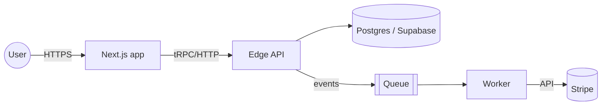

# Architecture Mapper

## Goal

Produce a **truthful, evidence-backed map** of how the system is (or will be) put together: which services exist, where the data lives and flows, which external providers are trusted, and which non-functional requirements (performance, availability, compliance) the architecture must satisfy.

The map is not aspirational. It describes what is real now and what is chosen for the next slice. Every choice is justified in an ADR (Architecture Decision Record) and every third-party dependency goes through `research-first` before it enters the map.

## When to use

**Always:**
- After `product-requirements` has defined the MVP scope and before `implementation-planner` starts producing code plans.
- When onboarding to an existing codebase (the map becomes the onboarding artifact).
- When introducing a new service, datastore, integration, queue, CDN, or payment provider.
- When changing a scaling tier (self-hosted → managed, single region → multi region, monolith → modular split).
- When the user asks for "architecture", "system design", "data flow", "diagram", "ADR", "decision record", "map the system".

**Trigger keywords:** "architecture", "system design", "data flow", "diagram", "ADR", "decision record", "topology", "service boundary", "dependency graph", "scaling plan", "non-functional requirements".

**Do NOT use for:**
- Pure feature implementation that does not change structure.
- Naming-only refactors.
- Code-style or lint decisions.

## Prerequisites

Run `research-first` for every third-party component that is new to the project. Do not add a provider to the map before its research note exists.

Then read:

1. `CLAUDE.md`
2. `.cursor/rules/02-tech-stack.mdc`
3. `memory/00-project-brief.md`
4. `memory/03-architecture.md` (current state)
5. `memory/04-data-model.md`
6. `memory/07-decisions-log.md` (what has been committed)
7. `memory/08-known-risks.md` (technical risks that shape the architecture)
8. `docs/product/prd.md` (what the architecture must serve)
9. `docs/product/executive-summary.md` (phase and confidence)

For existing codebases:
- If a Code Intelligence MCP is available, start with graph queries (symbols, dependencies, call paths) to map the architecture with minimal token cost.
- Only read full files when the graph data is insufficient.
- This keeps audits and architecture work efficient, especially in Claude multi-agent sessions.

## Process

### Step 1 — Scope the map

State the scope in one line at the top of `memory/03-architecture.md`:

> *"This architecture supports the MVP scope defined in `docs/product/prd.md` (<commit-sha-or-date>). It is valid for <phase> and does not attempt to serve the 5-year vision."*

Architecture sized for a vision that is not in the PRD is waste. Architecture sized only for today without optionality is brittle. Aim for the smallest architecture that serves the PRD plus named extension points.

### Step 2 — System map (`docs/architecture/system-map.md`)

Describe, in this order:

1. **Context diagram** — actors (users, admins, external systems) interacting with the system as a black box. Use Mermaid `flowchart LR`.
2. **Container diagram** — the major deployable units (frontend, API, background worker, database, cache, queue, CDN, etc.) with their responsibilities and the protocol between each pair.
3. **Service boundaries** — for each container, list its single responsibility in one sentence. If the sentence needs "and", the service is doing two things.
4. **Deployment topology** — which environment runs what (local / preview / staging / prod), with hosts and regions.

Mermaid example for the container diagram:



Every arrow must name the protocol and the direction of data movement.

### Step 3 — Data flow (`docs/architecture/data-flow.md`)

For each of the MVP's critical user flows (from `flow-analyzer`), document the data path:

- Which entity is created / updated / deleted at each step.
- Which container owns the write.
- Which container reads (and when — synchronously, via webhook, via scheduled job).
- Consistency model (strong / eventual) and the user-visible implications.
- Caching layers and their invalidation rules.

### Step 4 — Dependencies (`docs/architecture/dependencies.md`)

Two tables:

**Third-party services:**

| Service | Purpose | Owner | Plan / Limits | Research note | Risk if it fails |
|---|---|---|---|---|---|
| Stripe | Payments | org | Live, rate-limit 100 req/s | `docs/architecture/research/stripe-2026-05.md` | Checkout unavailable; queue webhook retries for 24h |
| Supabase | DB + Auth | org | Pro plan, 8 GB | `docs/architecture/research/supabase-2026-05.md` | Full outage |

**Internal libraries of note:**

| Package | Version | Why we pinned it | Migration plan if upgrade needed |
|---|---|---|---|

Every third-party row must link to a real `docs/architecture/research/<slug>.md` note produced by `research-first`. No link, no row.

### Step 5 — Non-functional requirements (NFRs)

List, with concrete numbers (not adjectives):

- **Performance:** target p95 latency per endpoint; cold-start budget for serverless.
- **Availability:** SLA target (e.g. 99.5% for MVP) and the downtime budget it implies.
- **Scalability:** expected load at launch; break-point load; scaling strategy to get past break-point.
- **Security:** compliance scope (none / SOC 2 / GDPR / HIPAA); encryption at rest and in transit.
- **Observability:** what is logged, what is traced, what is alerted, and where.
- **Cost envelope:** monthly cost ceiling at expected load.

Adjectives like "fast", "scalable", "secure" are banned. Numbers only.

### Step 6 — Architecture Decision Records (ADRs)

Every significant choice gets its own ADR under `docs/adr/NNNN-<slug>.md`, numbered sequentially, using this format:

```markdown
# ADR <NNNN> — <Title>

**Date:** YYYY-MM-DD
**Status:** Proposed | Accepted | Deprecated | Superseded by ADR-<NNNN>
**Decider(s):** User + <Model>

## Context
<what problem, what constraints, what was tried>

## Decision
<the choice, stated precisely>

## Alternatives considered
1. <option B> — why rejected
2. <option C> — why rejected

## Consequences
### Positive
### Negative
### Neutral

## Links
- Research note: docs/architecture/research/<slug>.md
- Related ADRs: …
- Related decisions: memory/07-decisions-log.md entry dated YYYY-MM-DD
```

ADRs are **never deleted**. A superseded ADR links forward to its replacement.

### Step 7 — Update `memory/03-architecture.md`

Keep this file as the **one-page executive view**. It must include:

- Stack justification (1–3 paragraphs).
- Link to current `docs/architecture/system-map.md`.
- Key NFRs (3–5 lines).
- List of accepted ADRs.
- List of open architectural questions (move to `memory/10-open-questions.md` if strategic).

Anything longer than one scroll belongs in `docs/architecture/`, not in `memory/`.

### Step 8 — Extension points

At the bottom of the system map, explicitly list the seams where the architecture can evolve without rewrite:

- "If we need multi-tenant, the tenant column is already on every row."
- "If the queue needs priorities, the abstraction in `src/queue/index.ts` can swap implementations."

Extension points are evidence of intentional design. No extension points is either a perfectly scoped MVP or a trap.

### Step 9 — Invoke `memory-updater`

Persist:

- `memory/03-architecture.md` refreshed.
- `memory/07-decisions-log.md` entry per accepted ADR.
- `memory/08-known-risks.md` updated with any new architectural risks.
- New ADRs under `docs/adr/`.
- Updated files under `docs/architecture/`.

### Step 10 — Closing

Summarize the architecture, then emit a **MEDIUM** Command Recommendation:

```markdown
"Architecture map updated. <N> ADRs accepted. <M> third-party dependencies with research notes. Non-functional budget: p95 <X>ms, SLA <Y>%, cost ceiling <Z>.

---
**Possible next commands (pick one):**
a) `/mm-plan <epic-slug>` — if you're ready to feed the architecture into `feature-breakdown` / `implementation-planner`.
b) `/mm-review` with security focus — if the architecture surfaces trust boundaries that need a threat-model pass.
c) `/mm-doubt "architectural trade-off"` — if a specific ADR still feels unresolved.
**Which?** reply `a`, `b`, or `c`."
```

## Outputs

- `docs/architecture/system-map.md` — context + containers + boundaries + topology.
- `docs/architecture/data-flow.md` — per-flow data paths and consistency.
- `docs/architecture/dependencies.md` — third-party + internal pinned dependencies.
- One or more ADRs under `docs/adr/NNNN-<slug>.md`.
- `memory/03-architecture.md` one-page executive view.
- Updated `memory/07-decisions-log.md`, `memory/08-known-risks.md`.

## Interactions with other skills

- **Runs after:** `product-requirements` (PRD exists); `research-first` for every new third-party piece.
- **Runs before:** `feature-breakdown`, `implementation-planner`, `security-review` (for threat modeling of critical flows).
- **Invokes:** `research-first` for every new provider/library; `memory-updater` at close.
- **Pairs with:** `flow-analyzer` — data-flow section consumes the flow specs; `security-review` — NFR security section feeds it.

## Completion checklist

- [ ] Scope line written: architecture serves the PRD, not the 5-year vision.
- [ ] Context + container diagrams included (Mermaid).
- [ ] Every service has a one-sentence single responsibility.
- [ ] Data flow documented per critical flow.
- [ ] Every third-party row links to a `research-first` note.
- [ ] NFRs stated with concrete numbers (no adjectives).
- [ ] Every significant decision has an ADR under `docs/adr/`.
- [ ] Extension points listed.
- [ ] `memory/03-architecture.md` updated with the one-page executive view.
- [ ] `memory-updater` ran.

## Anti-patterns

- **Avoid:** Designing for a 5-year vision when the PRD is an MVP. The cost is paid now; the value arrives never.
- **Avoid:** Adjectives ("fast", "scalable", "secure") in NFRs. Numbers only.
- **Avoid:** Adding a third-party provider without a `research-first` note.
- **Avoid:** A service description with "and" in it. Split.
- **Avoid:** ADRs written after the decision was silently made in code. The ADR is the contract; write it first or at the latest in the same PR.
- **Avoid:** Diagrams with 40+ boxes. Split into layered diagrams.
- **Avoid:** Deleting a superseded ADR instead of marking it `Superseded by ADR-NNNN`. History is how future teams learn.
- **Avoid:** Calling something an "extension point" when there is no actual seam in the code. Extension points are evidence-based, not claims.
