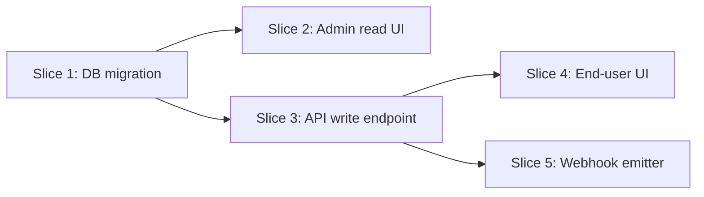

# Feature Breakdown

## Goal

Turn a **large epic or feature** into a **sequence of small, shippable, independently verifiable slices** — each of which delivers observable value and can be merged on its own. The breakdown is functional, not technical: it answers *"what ships first, and what ships next"*, not *"which files do we edit"*.

This skill exists because most production failures happen when a feature is shipped as one monolithic PR. Small slices give you: faster review, cheaper rollback, earlier user feedback, and a natural checkpoint to stop if scope was wrong.

## When to use

**Always:**
- After `product-requirements` has approved an epic that is > 1 week of engineering effort.
- When a user story depends on > 2 other changes (infra, schema, third-party, etc.).
- When a feature is cross-cutting (touches frontend + backend + DB + external service).
- When the user says "this is too big", "let's split this", "what should ship first", "how do we sequence this".

**Trigger keywords:** "break down", "decompose", "split", "scope", "sequence", "ship order", "what ships first", "incremental delivery".

**Do NOT use for:**
- Single-concern features that fit in one PR and one day of work.
- Bug fixes (use `bug-investigator` + `implementation-planner`).
- Pure refactors (plan directly with `implementation-planner`).

## Prerequisites

Read:

1. `CLAUDE.md`
2. `memory/00-project-brief.md`
3. `memory/03-architecture.md`
4. `memory/06-feature-map.md`
5. `docs/product/prd.md`
6. `docs/features/<relevant-epic>.md` (the epic being decomposed)
7. `docs/flows/*.md` — flows the feature touches
8. `docs/architecture/system-map.md` — boundaries the feature crosses
9. `memory/08-known-risks.md` — risks that affect sequencing

If the epic file does not yet exist, stop and run `product-requirements` first. Breaking down before the epic is approved leads to rework.

## Process

### Step 1 — Restate the epic

At the top of `docs/features/<epic>/breakdown.md`, copy the epic's Problem, User, Desired outcome, and Success metric verbatim. Breakdown work must never silently drift from the epic.

### Step 2 — Identify seams

A **seam** is a natural boundary along which the feature can be split without breaking it. Typical seams:

- **By user role** — ship admin first, then end-user.
- **By data** — ship the read surface, then the write surface.
- **By channel** — ship web first, then email notifications, then mobile.
- **By state** — ship the happy path, then error recovery.
- **By scale** — ship for 1 tenant, then multi-tenant.
- **By integration** — ship without the external provider (stub / mock), then wire the real provider.

List all the seams that apply. Rank them by *"which slice delivers the most user value with the least risk"*.

### Step 3 — Define slices

A **slice** is a unit of work that satisfies ALL of these rules:

- **Ships independently.** It can be released to users without the remaining slices.
- **Is observable.** It changes something users, operators, or metrics can see.
- **Is reversible.** It can be rolled back without data loss (or has an explicit, named migration path).
- **Is bounded.** Target size ≤ 3 engineer-days; max 5.
- **Has a single owner.**

For each slice, write in the breakdown doc:

```markdown
## Slice <N> — <title>

- **Ships:** <the observable change>
- **Depends on:** Slice <K>, Slice <M> (or "none")
- **Blocks:** Slice <P> (or "none")
- **Size:** S (≤1 day) | M (1–3 days) | L (3–5 days)
- **Architectural touch-points:** <services, tables, integrations affected>
- **Acceptance criteria:**
  - [ ] Given <precondition>, when <action>, then <observable>.
  - [ ] Edge case: …
- **Verification:** <how we will confirm it is done — manual, integration test, E2E, metric>
- **Rollback plan:** <how to undo safely>
- **Open questions:** <or "none">
- **Feature flag:** <name or "not needed">
```

Any slice that cannot fit the rules above must be split again (do not proceed until it fits).

### Step 4 — Dependency graph

Draw the dependency graph in Mermaid so the critical path is visible:



Identify:
- **Critical path** (longest chain).
- **Parallelizable work** (slices with no dependency between them).
- **Slices that can be deferred** (if time runs out, which slice drops first without breaking the release).

### Step 5 — Sequence

Produce the final ship order as a numbered list. Each number maps to a slice above. The first slice must deliver value end-to-end (even if narrow) — never ship infrastructure-only as the first public release.

If the first slice must be infra-only (e.g. a schema migration), mark it `internal-only` and plan the companion value slice to ship in the same sprint.

### Step 6 — Risk per slice

For each slice with size L or touching payments/auth/schema, add:

- **Risk:** <short description>
- **Mitigation:** <what we do before/during/after to reduce risk>
- **Feature flag / kill switch:** <explicit name and default value>

Rows without mitigations are incomplete. The exercise is naming what could go wrong, not listing risks abstractly.

### Step 7 — Integration with task management (optional, System 2)

If `task-master-ai` MCP is installed (System 2 phase), the breakdown file is the input to `task-master parse-prd`. Mention this explicitly in the doc header:

> *"Compatible with `task-master parse-prd` — each slice maps to a task with dependencies preserved."*

Until System 2, the breakdown is consumed by `implementation-planner` directly.

### Step 8 — Update `memory/06-feature-map.md`

Expand the MVP-scope row for the epic: add a "Slices" column listing `<count> (S/M/L split)` and a link to `docs/features/<epic>/breakdown.md`.

### Step 9 — Invoke `memory-updater`

Persist:

- New file under `docs/features/<epic>/breakdown.md`.
- Updated `memory/06-feature-map.md`.
- Entry in `memory/07-decisions-log.md` if sequencing involved a non-obvious trade-off.

### Step 10 — Closing

Summarize the breakdown, then emit a **HIGH** Command Recommendation (the next step is almost always planning the first slice):

```markdown
"Epic <name> broken into <N> slices. Critical path: <slice-list>. First slice to ship: <Slice 1>.

---
**Next recommended command:** `/mm-plan <Slice 1 slug>`
**Why:** slices are sequenced and independent; planning the first unblocks the TDD implementation loop.
**Go ahead:** type `go` and I'll proceed to `implementation-planner` as if you ran it.
**Skip if:** you want to refine a slice or run the next epic's breakdown first."
```

## Outputs

- `docs/features/<epic>/breakdown.md` — breakdown with seams, slices, dependency graph, sequence, risks.
- Updated `memory/06-feature-map.md`.
- Optional `memory/07-decisions-log.md` entry.

## Interactions with other skills

- **Runs after:** `product-requirements` (epic approved), `architecture-mapper` (when slices touch multiple services).
- **Runs before:** `implementation-planner` (for each slice), `flow-analyzer` (if a slice introduces a new flow), `test-strategist` (for slice-level coverage), `code-reviewer` (reviewing the breakdown itself).
- **Invokes:** `research-first` when a slice depends on a library/service still unverified; `memory-updater` at close.
- **Pairs with:** `implementation-planner` — breakdown produces the slice order, planner produces the code plan for each slice.

## Completion checklist

- [ ] Epic restated verbatim at the top.
- [ ] All relevant seams identified and ranked.
- [ ] Every slice satisfies: ships independently, observable, reversible, ≤ 5 days, single owner.
- [ ] Dependency graph in Mermaid.
- [ ] Ship order is explicit and first slice delivers observable value end-to-end (or is justified as internal-only).
- [ ] Size L slices and sensitive slices have Risk + Mitigation + Feature flag fields filled.
- [ ] `memory/06-feature-map.md` updated with slices column and link.
- [ ] `memory-updater` ran.

## Anti-patterns

- **Avoid:** Slices that share an implementation step. If Slice A and Slice B both require "add column X", they are not independent — split differently.
- **Avoid:** A first slice that is pure infrastructure with no user-visible or operator-visible effect. It cannot be verified, so it cannot be "done".
- **Avoid:** Slices larger than 5 days. Split again.
- **Avoid:** Slices defined by technology layer ("the backend slice", "the frontend slice"). Those are not shippable alone for most user-facing features.
- **Avoid:** Copying acceptance criteria from the epic as-is. Each slice has its own AC, narrower than the epic's.
- **Avoid:** Inventing dependencies that don't exist to feel more rigorous. The graph should be evidence-based.
- **Avoid:** Using this skill on trivial features that fit in a single PR. Overhead eats the benefit.
