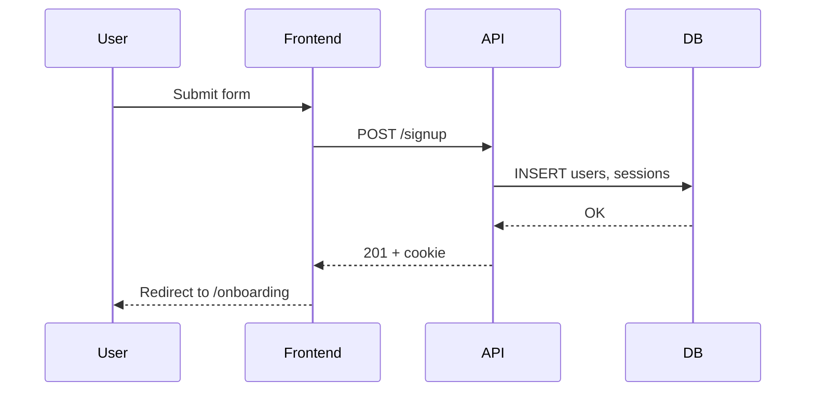
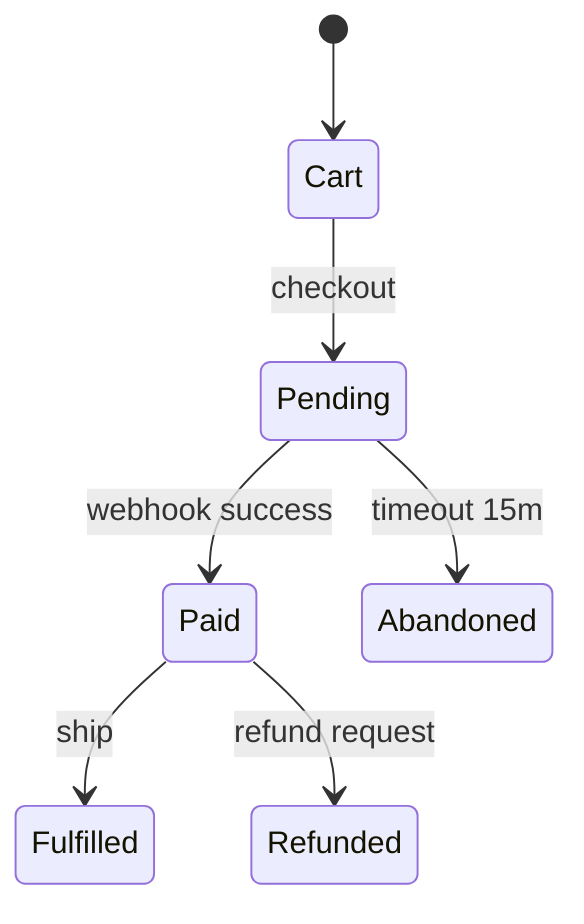

# Flow Analyzer

## Goal

Make every critical user flow **explicit, complete, and testable**. A flow document should answer, at every step: what the user sees, what the system does, what data changes, what can go wrong, and what happens when it does.

Most production bugs live not in features themselves but in the **gaps between steps** — timeouts, cancellations, partial failures, retries, concurrency. This skill forces those gaps to be named before code is written.

## When to use

**Always:**
- For any flow marked "critical" in `memory/05-user-flows.md` or the PRD.
- Before implementing signup, login, checkout, payment, onboarding, email verification, file upload, long-running jobs.
- Before `test-strategist` plans end-to-end coverage — E2E tests need a flow spec.
- When debugging a flow that behaves unexpectedly (use alongside `bug-investigator`).
- When a user story in `docs/features/<epic>.md` implies ≥ 3 steps with branching.

**Trigger keywords:** "flow", "user flow", "journey", "state machine", "happy path", "error path", "edge case", "onboarding", "signup", "checkout", "what happens when".

**Do NOT use for:**
- One-step interactions (a single button click with no branching).
- Flows already documented and unchanged since the last audit.
- Pure copy/content changes inside an existing flow.

## Prerequisites

Read:

1. `CLAUDE.md`
2. `memory/00-project-brief.md`
3. `memory/05-user-flows.md` (index of flows already documented)
4. `docs/product/prd.md` (for scope and success metrics of the flow)
5. `docs/features/<relevant-epic>.md` (user stories that the flow realizes)
6. `docs/product/personas.md`
7. `memory/04-data-model.md` (which entities the flow creates, mutates, or reads)
8. `memory/08-known-risks.md` (pre-existing risks that intersect the flow)

**Code context (token efficiency):** When analyzing implementation of flows in existing codebases, prefer Code Intelligence MCP (graph queries for call paths and dependencies) before loading large amounts of source code. Critical for efficient Claude multi-agent work.

## Process

### Step 1 — Scope the flow

Write at the top of `docs/flows/<flow-slug>.md`:

```markdown
# Flow: <Name>

**Persona:** <link to persona>
**Trigger:** <what starts the flow>
**Successful outcome:** <one observable result>
**Success metric:** <event or value the flow is supposed to move>
**Criticality:** Critical | High | Medium | Low
**Related epic:** <link to docs/features/<epic>.md>
**Related data entities:** <list from memory/04-data-model.md>
```

If any field is "?", run `doubt-surfacer` on the gap before continuing.

### Step 2 — Happy path (linear)

Write the step-by-step happy path as a numbered list. Every step must name:

- **Actor** — User | System | External service.
- **Action** — what happens.
- **UI state / feedback** — what the user sees.
- **Data effect** — entities created / updated / deleted, with names from `memory/04-data-model.md`.
- **External calls** — any third-party service, with timeouts and retry policy if applicable.

Example:

```markdown
### Step 3 — Submit form
- **Actor:** User
- **Action:** Clicks "Create account".
- **UI:** Button shows loading spinner; form is disabled.
- **Data:** No write yet.
- **External:** None.

### Step 4 — Validate & persist
- **Actor:** System (API)
- **Action:** Validates payload; creates `users` row; issues session cookie.
- **UI:** None yet.
- **Data:** `users` INSERT, `sessions` INSERT.
- **External:** None.
```

### Step 3 — Mermaid diagram

Add a sequence or flow diagram using Mermaid (renders natively in GitHub, Cursor, most viewers):



Keep it at one level of abstraction. A 40-box diagram is not a diagram, it is a screenshot.

### Step 4 — State machine (when applicable)

If the flow has non-linear states (e.g. order: `cart → pending → paid → fulfilled → refunded`), model it as a state machine. Use Mermaid `stateDiagram-v2`:



List every state with its invariants ("in state X, field Y must be null") — invariants are what tests check.

### Step 5 — Error paths (mandatory)

For every step, enumerate what can fail and how. Minimum categories:

- **Validation errors** — user input doesn't match schema.
- **Authorization errors** — user lacks permission.
- **Conflict / concurrency** — resource already exists, row updated concurrently.
- **External service failures** — timeout, 5xx, rate limit.
- **Partial failures** — step N succeeded, step N+1 didn't; recovery / rollback strategy.
- **User abandonment** — user closes the tab mid-flow; resume behavior.
- **Network / offline** — reconnect behavior.

For each failure, specify:

```markdown
### Failure: <name>
- **Where:** Step <N>
- **Cause:** <what triggers it>
- **User sees:** <message, UI state>
- **System does:** <rollback, retry, queue, log>
- **Recovery:** <what the user or system can do next>
- **Test hook:** <how an automated test reproduces this>
```

### Step 6 — Edge cases (must have ≥ 5)

Examples of edge cases the skill must consider by default:

- Double submit (user clicks twice quickly).
- Back-button mid-flow.
- Different devices / viewports.
- Slow network (3G simulation).
- Feature flag off.
- Not-yet-verified user (email unverified, phone not linked).
- Timezone boundary (midnight, DST).
- Currency / locale variation.
- Accessibility (keyboard only, screen reader).
- Bulk / pagination edge (empty list, exactly one item, 10,000 items).

Pick at least 5 that genuinely apply. If fewer genuinely apply, justify each omission in writing.

### Step 7 — Derived test cases

Produce a compact table at the bottom of the flow doc mapping steps + failures + edge cases to test cases:

```markdown
| Case | Type | Expected | Priority |
|---|---|---|---|
| Happy path signup | E2E | New user in DB + redirect | P0 |
| Duplicate email | Integration | 409 + user sees "email already used" | P0 |
| Network timeout on step 4 | Integration | Retry up to 2x, then error | P1 |
| Back-button mid-signup | E2E | Form state preserved; no duplicate submit | P1 |
| Slow network, 3G | E2E | Loading state visible; no phantom success | P2 |
```

`test-strategist` consumes this table directly.

### Step 8 — Update `memory/05-user-flows.md`

Keep the memory file as an **index**, not a duplicate:

```markdown
## Critical flows
- [Signup](../docs/flows/signup.md) — Criticality: Critical — Last updated: YYYY-MM-DD
- [Checkout](../docs/flows/checkout.md) — Criticality: Critical — Last updated: YYYY-MM-DD

## Secondary flows
- …
```

### Step 9 — Invoke `memory-updater`

Persist:

- `memory/05-user-flows.md` index refreshed.
- `memory/07-decisions-log.md` entry if any flow decision was made (e.g. "chose magic-link over password+OTP for signup").
- `memory/08-known-risks.md` updated if new flow-related risks surfaced.

### Step 10 — Closing invitation

Summarize the flow doc, then emit a **MEDIUM** Command Recommendation:

```markdown
"Flow <Name> documented at `docs/flows/<slug>.md`. <K> error paths and <N> edge cases identified.

---
**Possible next commands (pick one):**
a) `/mm-plan <test-coverage-slug>` — hand off to `test-strategist` / `implementation-planner` for E2E coverage of this flow.
b) Run `flow-analyzer` on another flow — if there is another critical flow pending documentation.
c) `/mm-review` on the error matrix — if you want a second pass before testing.
**Which?** reply `a`, `b`, or `c`."
```

## Outputs

- `docs/flows/<flow-slug>.md` — one file per flow with scope, happy path, diagrams, state machine, error paths, edge cases, test matrix.
- Updated index in `memory/05-user-flows.md`.
- Updated `memory/07-decisions-log.md` and `memory/08-known-risks.md` when applicable.

## Interactions with other skills

- **Runs after:** `product-requirements` (the flow realizes a user story).
- **Runs before:** `test-strategist` (flow doc feeds the test matrix), `implementation-planner` (plan references the flow spec), and `bug-investigator` when debugging a flow bug.
- **Invokes:** `memory-updater` at close, `doubt-surfacer` if scope fields are missing.
- **Pairs with:** `security-review` when the flow touches auth/payments/data mutations.

## Completion checklist

- [ ] Scope block complete (persona, trigger, outcome, metric, criticality, related epic, data entities).
- [ ] Happy path written step-by-step with actor / action / UI / data / external for each step.
- [ ] Mermaid diagram included.
- [ ] State machine included when the flow is non-linear.
- [ ] Every step has enumerated failure modes across the 7 categories.
- [ ] ≥ 5 edge cases considered and documented (or omissions justified).
- [ ] Test matrix table produced for `test-strategist` handoff.
- [ ] `memory/05-user-flows.md` index updated.
- [ ] `memory-updater` ran.

## Anti-patterns

- **Avoid:** Documenting the happy path and stopping. Error paths are where real bugs live.
- **Avoid:** Mermaid diagrams with 40+ nodes. Split into sub-flows or redraw at a higher level.
- **Avoid:** Vague failure descriptions ("handle errors gracefully"). Either specify the behavior or mark it as an open decision.
- **Avoid:** Copying acceptance criteria from the epic into the flow. The flow is deeper — it must go beyond the AC.
- **Avoid:** Writing flows for trivial interactions (single click, no branching). Flow analysis overhead should correlate with flow criticality.
- **Avoid:** Inconsistent naming between the flow doc and the data model. Use the entity names from `memory/04-data-model.md` literally.
- **Avoid:** Leaving the "Test hook" field empty on failure entries. No hook means the failure cannot be tested and will return as a bug.
