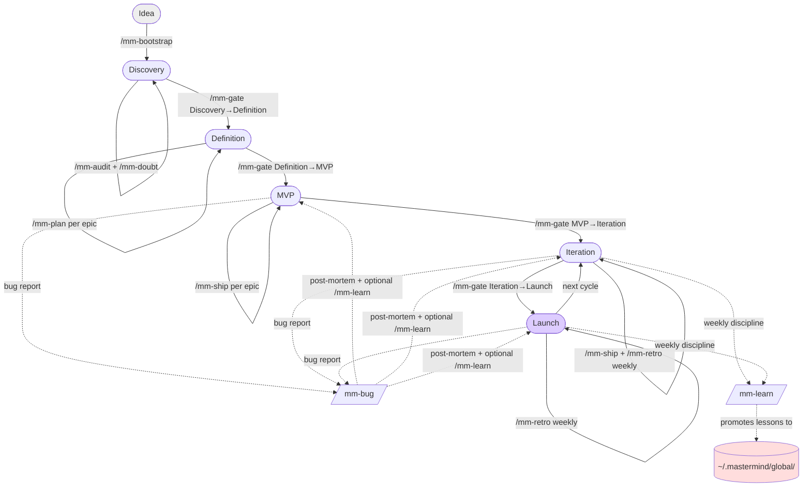
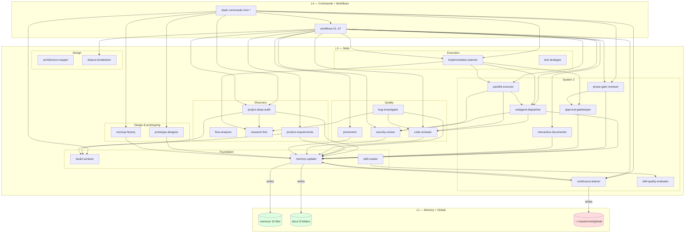
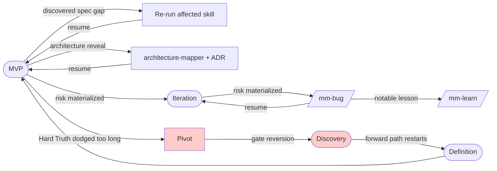

# MASTERMIND 2.0 — Operating Guide

> **Who this is for.** Anyone cloning the template to drive a SaaS or app project end-to-end: the author, collaborators, future-you, and AI agents (Cursor, Claude Code, Claude Desktop) reading this repo.
>
> **What this is.** The operational manual for the template. It explains how the 26 skills, 7 workflows, 17 slash commands, 9 rules, 15 memory files, hooks, scripts, and MCPs coordinate across the seven project phases (Idea → Discovery → Definition → Prototype → MVP → Iteration → Launch; Prototype is optional for non-UI projects). It shows which component runs when, why, and what to do when the plan no longer fits reality.
>
> **How to read this.** Linearly for the first read. By section afterwards (the TOC is organized by operational need, not by layer).

**Version.** v1.0 — System 1 + System 2 feature-complete.

---

## Table of contents

1. [The 30-second map](#1-the-30-second-map)
2. [Architecture in four layers](#2-architecture-in-four-layers)
3. [Skill inventory map](#3-skill-inventory-map)
4. [Project lifecycle — the full arc](#4-project-lifecycle--the-full-arc)
5. [Phase by phase (operational playbook)](#5-phase-by-phase-operational-playbook)
6. [Execution modes — Coach, Executor, Auditor](#6-execution-modes--coach-executor-auditor)
7. [How components coordinate](#7-how-components-coordinate)
8. [Going back — when System 2 bounces you to System 1](#8-going-back--when-system-2-bounces-you-to-system-1)
9. [End-to-end worked example: "Notas-AI"](#9-end-to-end-worked-example-notas-ai)
10. [Parallel execution patterns](#10-parallel-execution-patterns)
11. [Cross-project memory in practice](#11-cross-project-memory-in-practice)
12. [Hooks in action](#12-hooks-in-action)
13. [FAQ — common situations](#13-faq--common-situations)
14. [Operator cheatsheet](#14-operator-cheatsheet)
15. [Appendix — full component index](#15-appendix--full-component-index)

---

## 1. The 30-second map

MASTERMIND 2.0 is **a Project Operating System** that makes AI-assisted development predictable, reviewable, and persistent. It is not a framework; it is a **repository layout + a discipline**.

```
                   ┌──────────────────────────────────────────┐
                   │          YOU (the operator)              │
                   │       + AI agents (Cursor / Claude)      │
                   └───────────────────┬──────────────────────┘
                                       │  invokes
                                       ▼
          ┌───────────────────────────────────────────────────────┐
          │  SLASH COMMANDS  (.claude/commands/mm-*)              │
          │  /mm-bootstrap /mm-ship /mm-bug /mm-gate /mm-retro    │
          │  /mm-audit /mm-plan /mm-doubt /mm-next /mm-review     │
          │  /mm-learn                                            │
          └───────────────────────────────────────────────────────┘
                                       │  wraps
                                       ▼
          ┌───────────────────────────────────────────────────────┐
          │  WORKFLOWS  (.claude/workflows/)                      │
          │  01 bootstrap · 02 feature-lifecycle · 03 bug-triage  │
          │  04 phase-gate · 05 weekly-retro                      │
          └───────────────────────────────────────────────────────┘
                                       │  composes
                                       ▼
          ┌───────────────────────────────────────────────────────┐
          │  SKILLS  (.cursor/skills/, 26 total)                  │
          │  System 1 (17) — doubt-surfacer · project-deep-audit ·│
          │  product-requirements · architecture-mapper ·         │
          │  feature-breakdown · flow-analyzer · research-first · │
          │  implementation-planner · test-strategist ·           │
          │  bug-investigator · code-reviewer · security-review · │
          │  memory-updater · skill-creator · prototype-designer ·│
          │  mockup-factory · premortem                           │
          │  System 2 (9) — phase-gate-reviewer ·                 │
          │  approval-gatekeeper · subagent-dispatcher ·          │
          │  parallel-executor · continuous-learner ·             │
          │  retroactive-documenter · skill-quality-evaluator ·   │
          │  eval-harness · context-budget                        │
          └───────────────────────────────────────────────────────┘
                                       │  governed by
                                       ▼
          ┌───────────────────────────────────────────────────────┐
          │  RULES  (.cursor/rules/00..08.mdc, always loaded)     │
          │  00 OS · 01 Karpathy · 02 stack · 03 testing ·        │
          │  04 safety+git · 05 MCP · 06 modes · 07 subagents     │
          └───────────────────────────────────────────────────────┘
                                       │  persists to
                                       ▼
          ┌───────────────────────────────────────────────────────┐
          │  MEMORY  (memory/, 14 Git-versioned files)            │
          │  brief · vision · state · architecture · data model · │
          │  flows · features · decisions log · risks · testing · │
          │  open Qs · session summary · open doubts · phase log  │
          └───────────────────────────────────────────────────────┘
                                       │  feeds & is fed by
                                       ▼
          ┌───────────────────────────────────────────────────────┐
          │  CROSS-PROJECT MEMORY  (~/.mastermind/global/)        │
          │  lessons · patterns · pitfalls · stacks · vendors     │
          └───────────────────────────────────────────────────────┘
```

Five ideas hold everything together:

1. **Structure is intelligence.** A well-organized repo beats the smartest prompt. The repo is the brain.
2. **Clarity before code.** Every non-trivial action runs the Question & Doubt Protocol first. Assumptions become explicit; questions get asked before deliverables are produced.
3. **Surgical over sweeping.** Karpathy principles are always active. Every changed line traces back to a named request.
4. **Gates, not drift.** Phase transitions are ceremonies with exit criteria, not gradual slides.
5. **Memory that survives.** Sessions end, models change; the repo's `memory/` and `~/.mastermind/global/` remain.

The rest of this guide is how those five ideas become a day-to-day workflow.

---

## 2. Architecture in four layers

The template has four layers, in increasing order of abstraction. Every artifact belongs to exactly one layer, and the dependencies flow one way: upper layers reference lower ones, not the reverse.

```
┌────────────────────────────────────────────────────────────┐
│  L4  COMMANDS + WORKFLOWS     (the "what do I invoke?")    │
│       /mm-* · .claude/workflows/                           │
└────────────────────────────────────────────────────────────┘
                   │ composes
                   ▼
┌────────────────────────────────────────────────────────────┐
│  L3  SKILLS                   (the "how do I do X well?")  │
│       .cursor/skills/<name>/SKILL.md                       │
└────────────────────────────────────────────────────────────┘
                   │ constrained by
                   ▼
┌────────────────────────────────────────────────────────────┐
│  L2  RULES                    (the "what is always true?") │
│       .cursor/rules/00..08.mdc + CLAUDE.md kernel          │
└────────────────────────────────────────────────────────────┘
                   │ produces & consumes
                   ▼
┌────────────────────────────────────────────────────────────┐
│  L1  MEMORY                   (the "what do I remember?")  │
│       memory/ (14 files) + docs/ + ~/.mastermind/global/   │
└────────────────────────────────────────────────────────────┘
```

### L1 — Memory (the substrate)

**Purpose.** State that must survive a session, a model switch, or a restart. If it matters, it lives here or in `docs/`.

| File | Holds |
|---|---|
| `memory/00-project-brief.md` | Product, users, value prop, tech stack, non-negotiables |
| `memory/01-product-vision.md` | North Star, 12-month + 3-year vision, what we are NOT |
| `memory/02-current-state.md` | One-page snapshot: what exists, what is in progress, what is blocked |
| `memory/03-architecture.md` | One-page architecture view + ADR index |
| `memory/04-data-model.md` | Entities, relationships, migrations policy |
| `memory/05-user-flows.md` | Index of critical flows (details in `docs/flows/`) |
| `memory/06-feature-map.md` | MVP + backlog + killed, with statuses |
| `memory/07-decisions-log.md` | Append-only decision log (canonical format) |
| `memory/08-known-risks.md` | Risk table (Impact × Likelihood × Mitigation × Status) |
| `memory/09-testing-status.md` | Coverage snapshot, gaps, flaky tests |
| `memory/10-open-questions.md` | Long-lived strategic questions |
| `memory/11-session-summary.md` | Append-mode log of every meaningful session |
| `memory/12-open-doubts-and-questions.md` | AI ↔ user Q&A register |
| `memory/13-phase-history.md` | Append-only log of phase transitions |
| `memory/14-design-system.md` | Per-project source of truth for visual decisions, **platform-aware**. Fields: Platform (web/mobile/cross), Project identity, Tokens (colors/typography/spacing/motion), Installed components, Custom components, Mobile-specific (safe-area, orientation, tab bar, gestures, preview pipeline), Likes, Anti-patterns, Patterns, References, Changelog. Updated by `prototype-designer` via `/mm-design`. Exportable to portable `DESIGN.md` via `scripts/export-design-md`. |

Plus the `docs/` folder (8 subfolders: product, architecture, features, flows, api, testing, security, adr) for human-readable artifacts, and `~/.mastermind/global/` for cross-project memory.

### L2 — Rules (the contract)

**Purpose.** Invariants loaded on every turn. They define what *always* happens.

| Rule | Responsibility |
|---|---|
| `00-project-operating-system.mdc` | Read order, Question Protocol, execution discipline, model routing |
| `01-karpathy-principles.mdc` | Think / Simplicity / Surgical / Goal-Driven — verbatim canon |
| `02-tech-stack.mdc` | Stack chosen per project; universal JS/TS conventions when applicable |
| `03-testing-policy.mdc` | Adaptive pyramid (70/20/10 / 30/20/50 / 100% smoke per phase); mandatory areas |
| `04-safety-and-git.mdc` | Safety guardrails; branching; Conventional Commits; git hooks |
| `05-claude-mcp-integration.mdc` | MCP policy (Context7 always, Playwright on demand); cross-project memory; task-master activation |
| `06-execution-modes.mdc` | Coach / Executor / Auditor modes, selection priority, transitions |
| `07-subagent-orchestration.mdc` | Subagent dispatch; worktrees; two-stage review; continuous learning loop |
| `08-design-system.mdc` | Design system policy, **platform-aware**. Web track: shadcn/ui + Tailwind + Claude Design. Mobile track: react-native-reusables (RNR) + NativeWind + Expo + Claude Design mobile mode + Expo Go preview. Cross = both. memory/14 §Platform drives everything. |

Plus the kernel `CLAUDE.md` at the root and `AGENTS.md` for non-Cursor agents.

### L3 — Skills (the playbooks)

**Purpose.** Reusable, composable procedures for specific tasks. Each skill has a single responsibility.

26 skills, organized in the next section.

### L4 — Commands + Workflows (the ergonomics)

**Purpose.** Turn "remember to run skill X, then Y, then Z, then log to `memory/07`" into a single invocation.

7 workflows + 17 slash commands. Workflows are the sequences; commands are shortcuts to workflows or skills with curated context loading.

---

## 3. Skill inventory map

The 26 skills, grouped by role along the project lifecycle.

### System 1 — Analysis & Documentation (17 skills)

**Foundation (3).** The cross-cutting skills every other one depends on.

| Skill | Role |
|---|---|
| `doubt-surfacer` | Force the Question & Doubt Protocol. Surface assumptions, ask 8–20 questions, wait for answers. |
| `memory-updater` | Persist session output to the right `memory/` files. Append-mode for session summary. Flag lesson candidates. |
| `skill-creator` | Author and audit skills per the Agent Skills spec and MASTERMIND conventions. |

**Discovery (4).** Understand the space before shaping the product.

| Skill | Role |
|---|---|
| `project-deep-audit` | Multi-angle audit (12 angles) of a new project or existing codebase. Always ends with a Hard Truth. |
| `product-requirements` | Turn a validated problem into a PRD: personas, MVP boundary, epics, user stories with RICE. |
| `flow-analyzer` | Document user flows with happy path + 7 categories of error paths + ≥5 edge cases + test matrix. |
| `research-first` | Force Context7 / web research before any code that uses an external library or service. |

**Design (2).** Translate the PRD into a buildable plan.

| Skill | Role |
|---|---|
| `architecture-mapper` | Map services, data flow, NFRs (numbers only), dependencies (each backed by a research note), ADRs. |
| `feature-breakdown` | Decompose an epic into independent shippable slices (≤5 days each), with dependency graph. |

**Execution (2).** Produce code.

| Skill | Role |
|---|---|
| `implementation-planner` | Turn a slice into a bite-sized TDD plan under `.cursor/plans/` with complete code + verification per step. |
| `test-strategist` | Decide pyramid ratio per phase, mock strategy, coverage gap analysis. Feeds CI. |

**Quality (4).** Prevent and fix defects; stress-test high-cost decisions.

| Skill | Role |
|---|---|
| `bug-investigator` | 4-phase debugging: reproduce → isolate → diagnose root cause → surgical fix with regression test. |
| `code-reviewer` | 11-category review (plan compliance, scope, correctness, tests, architecture, quality, performance, readability, simplicity, docs, git hygiene). Verdict by severity. |
| `security-review` | Threat model + OWASP-contextual review for auth, payments, schema, public API, etc. |
| `premortem` | Klein/Kahneman prospective-hindsight ("this already failed — narrate why") for high-cost / irreversible decisions. Fans out 5–7 sub-agents; synthesizes failure modes + revised plan. |

**Design & prototyping (2).** Validate the experience before building.

| Skill | Role |
|---|---|
| `prototype-designer` | Bridge memory (flows, features, tokens) to Claude Design for SINGLE-feature prototyping during MVP / Iteration. Platform-aware (web: shadcn/ui; mobile: RNR). |
| `mockup-factory` | FULL-APP iterative prototyping in the dedicated Prototype phase: `create v1` → `iterate vN` → `freeze`. Outputs to `docs/design/mockups/`; consolidates memory/14 on freeze. |

### System 2 — Execution & Orchestration (9 skills)

**Execution foundation (2).** When and who intervenes.

| Skill | Role |
|---|---|
| `phase-gate-reviewer` | Validate phase transitions (Idea → Discovery → Definition → Prototype → MVP → Iteration → Launch). Verdict: PROCEED / PROCEED WITH CAVEATS / BLOCK. Prototype is optional; non-UI projects may skip Definition→MVP directly with justification. |
| `approval-gatekeeper` | Human-in-the-Loop enforcer: classify action (Trivial / Routine / Moderate / Sensitive / High-impact / Forbidden) and return AUTO_APPROVE / REQUIRE_HUMAN_APPROVAL / BLOCK. |

**Orchestration (2).** Multi-agent execution.

| Skill | Role |
|---|---|
| `subagent-dispatcher` | Within one workspace. Fresh subagent per task + two-stage review (spec then quality). |
| `parallel-executor` | Across workspaces (Git worktrees). Independence analysis, merge order, runtime isolation decisions. |

**Learning (1).** Close the loop between projects.

| Skill | Role |
|---|---|
| `continuous-learner` | Promote qualifying lessons from the project to `~/.mastermind/global/`. Applies the 3-part test (project-agnostic, evidence-backed, actionable). Requires per-entry user approval. |

**Onboarding (1).** Seed the system from existing code.

| Skill | Role |
|---|---|
| `retroactive-documenter` | Seed `memory/` from an existing codebase (code + git log + README + lockfiles) when onboarding a project not born from MASTERMIND. Per-file approval. |

**Quality gate (1).** Keep the skill library healthy.

| Skill | Role |
|---|---|
| `skill-quality-evaluator` | Static-analysis lint for `SKILL.md` files (frontmatter, 9-section template, line budget, anti-patterns). Per-skill score + findings. |

**Evals (1).** Close the trace → eval → improve loop.

| Skill | Role |
|---|---|
| `eval-harness` | Converts confirmed `bug-investigator` post-mortems into permanent deterministic regression cases, and reads `.mastermind/runtime/dispatch-log.jsonl` for a lightweight dispatch eval (success/blocked rates, cost/latency by role and model). Zero new runtime deps. |

**Context discipline (1).** Keep the agent effective in long sessions.

| Skill | Role |
|---|---|
| `context-budget` | Active management of the agent's own context window: persist to `memory/` first, compact at ~70% of the usable window, clear stale tool results, keep guardrails resident. Markdown on disk stays canonical; live context is a disposable working set. |
| Code Intelligence (opt.) | Tree-sitter/graph MCPs (e.g. jCodeMunch) for symbol-level code retrieval (callers, impact) instead of full files. Reduces tokens in code-heavy work (audits, plans). See CLAUDE.md §Code Context Layer. Integrated in relevant skills. |

### Shape of a skill

Every `SKILL.md` follows the MASTERMIND 9-section template:

1. Title
2. Goal
3. When to use (Always / Do NOT / Trigger keywords)
4. Prerequisites (files to read, skills to run first)
5. Process (numbered steps with checkpoints)
6. Outputs (exact paths)
7. Interactions (Invoked by / Invokes / Pairs with)
8. Completion checklist
9. Anti-patterns

This shape is enforced by `skill-creator`. New skills live at `.cursor/skills/<name>/SKILL.md` and are auto-mirrored to `.claude/skills/<name>/SKILL.md` via `scripts/sync-skills`.

---

## 4. Project lifecycle — the full arc

A MASTERMIND project moves through six phases. Each phase has a purpose, entry criteria, expected artifacts, exit criteria, and a canonical workflow. Transitions are gated — you do not slide between phases, you cross them with explicit approval.

### 4.1 Lifecycle diagram (Mermaid)



### 4.2 Phase summary table

> **Authoritative criteria live in `phase-criteria.json`** (rendered into `memory/13 §Phase definitions` by `scripts/render-phase-criteria`, consumed by `phase-gate-reviewer` and `phase-gate-check`). The tables/prose in §4.2 and §5 are an operational narrative; if they ever disagree with `phase-criteria.json`, the JSON wins. (The optional 7th phase, **Prototype**, sits between Definition and MVP for UI projects — see `phase-criteria.json`.)

| # | Phase | Purpose | Duration (typical) | Canonical workflow |
|---|---|---|---|---|
| 1 | **Idea** | A sentence-to-paragraph description exists | Hours to a day | `/mm-bootstrap` starts the transition |
| 2 | **Discovery** | Validate problem + user + market | 1–3 weeks | `/mm-audit` + `/mm-doubt`; ends with `/mm-gate Discovery→Definition` |
| 3 | **Definition** | Lock MVP scope + architecture + ADRs | 1–2 weeks | `/mm-plan` per epic + `architecture-mapper`; ends with `/mm-gate Definition→MVP` |
| 4 | **MVP** | Build and ship the MVP | 4–12 weeks | `/mm-ship` per epic (workflow 02); `/mm-bug` when issues arise |
| 5 | **Iteration** | Learn from real users, improve | Continuous | `/mm-ship` for new slices; `/mm-retro` weekly |
| 6 | **Launch** | Public release, scale, SLA | Continuous | Same as Iteration + tighter `/mm-review` + security pass |

### 4.3 Non-negotiables at the lifecycle level

- **Phase transitions never happen silently.** Every transition runs `/mm-gate` → `phase-gate-reviewer` → user approval → `memory/13-phase-history.md` entry.
- **Every phase ends with a `memory-updater` pass.** No un-persisted learning between phases.
- **Bugs live in parallel with whatever phase you're in.** `/mm-bug` is a pull-in-from-anywhere workflow; it never interrupts the phase, it runs alongside.
- **Cross-project lessons are promoted at the gate or in the weekly retro, not randomly.** `continuous-learner` reads sessions in a window, applies the 3-part test, writes only on user approval.

---

## 5. Phase by phase (operational playbook)

Each phase section has the same shape: purpose, entry criteria, what happens inside, artifacts produced, exit criteria, and the transition out.

> **Source of truth:** the entry/exit criteria and expected artifacts below are a human-readable narrative. The authoritative, machine-checked version is `phase-criteria.json` (verified by `/mm-template-audit`). Edit criteria there, not here — this section explains *how to work* each phase, not what gates it.

### 5.1 Phase — Idea

**Purpose.** You have a sentence-to-paragraph description of something. Nothing is decided.

**Entry criteria.**
- The template is cloned into a new repo.
- `memory/02-current-state.md` Phase field reads `Idea` (or is the template placeholder).
- No PRD, no architecture, no audit yet.

**What happens.**

Run `/mm-bootstrap <idea>`. This invokes workflow `01-new-project-bootstrap` which is:

```
Phase 1 — Orientation (Coach)
    Read CLAUDE.md + rules 00, 01, 06.
    If ~/.mastermind/global/ exists: read lessons, pitfalls, patterns.

Phase 2 — Rough brief
    Fill memory/00-project-brief.md with real data or explicit _TBD_.
    Commit docs(memory): draft initial project brief.

Phase 3 — doubt-surfacer
    Run the Question Protocol. 8–20 questions. User answers.
    Update memory/12-open-doubts-and-questions.md.

Phase 4 — project-deep-audit
    12 mandatory angles → artifacts in docs/product/ + docs/architecture/.
    Top 10 risks → memory/08-known-risks.md.
    Hard Truth paragraph → docs/product/executive-summary.md.

Phase 5 — phase-gate-reviewer, target Discovery
    Dry-run with scripts/phase-gate-check.ps1 -NextPhase Discovery.
    Formal review. User approves.
    Write transition entry to memory/13-phase-history.md.

Phase 6 — memory-updater
    Append session summary to memory/11-session-summary.md.
    Log bootstrap decision in memory/07-decisions-log.md.
```

**Artifacts produced.**
- Full `memory/00` filled.
- `docs/product/executive-summary.md`, `product-map.md`, `personas.md`, `competitive-analysis.md`, `business-model.md`, `scenarios-and-pivots.md`, `top-10-actions.md`.
- Early `docs/architecture/system-map.md`.
- `docs/features/feature-inventory.md`.
- `docs/security/security-risk-map.md`.
- `memory/08-known-risks.md` with Top 10.
- `memory/12-open-doubts-and-questions.md` populated.
- `memory/13-phase-history.md` with first transition entry.

**Exit criteria.**
- `scripts/phase-gate-check.ps1 -NextPhase Discovery` reports PASS.
- Phase advanced to `Discovery` in `memory/02-current-state.md`.
- Hard Truth present and acknowledged.

**Transition out.**
- Workflow 01 runs `/mm-gate Discovery` internally; at exit the phase is already Discovery.

---

### 5.2 Phase — Discovery

**Purpose.** Validate the problem is real, the users exist, the market matters. Build shared understanding, not a PRD yet.

**Entry criteria.**
- `memory/02-current-state.md` Phase = `Discovery`.
- The Idea bootstrap artifacts from phase 1 exist.
- `memory/08-known-risks.md` has Top 10 risks listed.

**What happens.**

Discovery is the most iterative phase. Typical operations:

- **`/mm-audit`** when you want to re-run or deepen the audit as you learn more.
- **`/mm-doubt`** anytime you feel uncertain about an assumption.
- **Direct conversation** with `doubt-surfacer` about specific risks ("what could kill this pivot?").
- **`research-first`** invoked manually for any claim about a tool, vendor, stack, or competitor.

Discovery is **Coach mode by default**. No code is written; documents in `docs/product/` grow; `memory/08-known-risks.md` evolves.

**Exit criteria to Definition.**
- `docs/product/executive-summary.md` is current and the Hard Truth is accepted or actively being addressed.
- At least one validated persona in `docs/product/personas.md` (validated = you interviewed real users, or you have clear data, not "I think solo freelancers care about X").
- `memory/08-known-risks.md` has mitigations for every Critical risk, or those risks are explicitly accepted.
- No unresolved P0 question in `memory/12-open-doubts-and-questions.md`.

**Transition out.**
- Run `/mm-gate Definition`. This invokes workflow 04 which calls `phase-gate-reviewer`.
- User explicitly confirms the draft transition entry.
- `memory/13-phase-history.md` gains the `Discovery → Definition` row.

**Typical duration.** 1–3 weeks. If it takes > 6 weeks, something is off — either the idea has a fatal flaw that phase gate keeps catching, or the user is avoiding a decision.

**Common anti-patterns in Discovery.**
- Skipping real user validation and calling the personas "done".
- Treating the Hard Truth as a suggestion instead of a hard input to the next phase.
- Running audit after audit without ever committing to a single persona.

---

### 5.3 Phase — Definition

**Purpose.** Decide exactly what ships for the MVP. Lock personas, scope, architecture, and the rough plan.

**Entry criteria.**
- `memory/02-current-state.md` Phase = `Definition`.
- Discovery artifacts are current.

**What happens.**

```
Step 1 — product-requirements (per primary persona)
    Invoke via /mm-plan <epic-slug> or directly.
    Produces docs/product/prd.md with:
      - MVP Boundary (one persona, one JTBD, one metric, three non-goals)
      - 3–7 epics (no more)
      - User stories with Given/When/Then acceptance criteria
      - RICE table, MVP cut-line

Step 2 — architecture-mapper
    System map, container diagram, data flow, dependencies (each with research-first note),
    NFRs in numbers only, ADRs numbered sequentially.
    Output: docs/architecture/system-map.md + docs/architecture/data-flow.md + docs/architecture/dependencies.md + docs/adr/NNNN-*.md.

Step 3 — flow-analyzer (per critical flow)
    For each user story marked critical (auth, payments, data mutations, core monetization flow):
    - Happy path step-by-step (Actor / Action / UI / Data / External)
    - Mermaid diagram
    - State machine if non-linear
    - Error paths across 7 categories
    - ≥ 5 edge cases
    - Test matrix
    Output: docs/flows/<slug>.md (one per critical flow).

Step 4 — test-strategist
    Decide pyramid ratio (in MVP: usually 30/20/50 skewed to E2E smoke).
    Mock strategy per external dependency.
    Gap analysis. Flake policy.
    Output: docs/testing/strategy.md.

Step 5 — feature-breakdown (per epic)
    Decompose approved epics into ≤5-day shippable slices.
    Dependency graph, merge order hints, risk per sensitive slice.
    Output: docs/features/<epic>/breakdown.md.
```

**Artifacts produced.**
- `docs/product/prd.md` with MVP boundary locked.
- `docs/features/<epic-slug>.md` per epic + `docs/features/<epic>/breakdown.md` per slice.
- `docs/architecture/system-map.md`, `data-flow.md`, `dependencies.md`.
- `docs/adr/NNNN-*.md` per major architectural decision.
- `docs/flows/<slug>.md` for every critical flow.
- `docs/testing/strategy.md`.
- `memory/03-architecture.md` (one-page executive view), `memory/04-data-model.md`, `memory/05-user-flows.md` index, `memory/06-feature-map.md` rows.

**Exit criteria to MVP.**
- PRD approved (signed line in `memory/07-decisions-log.md`).
- Every architectural decision has an ADR.
- Every slice of every MVP epic has a breakdown file.
- Testing strategy exists.
- `scripts/phase-gate-check.ps1 -NextPhase MVP` PASS.

**Transition out.**
- `/mm-gate MVP`. `phase-gate-reviewer` verifies all exit criteria.
- Optional: activate `task-master-ai` at this point via `scripts/install-taskmaster.ps1` if the plan has ≥10 tasks.

**Typical duration.** 1–2 weeks. Definition that takes months is a sign Discovery was skipped.

---

### 5.4 Phase — MVP

**Purpose.** Build the shipped product. Sweat, commit, review, merge.

**Entry criteria.**
- PRD approved; epics defined; breakdowns done; flows documented; test strategy chosen.
- Phase gate passed.
- Stack confirmed in `.cursor/rules/02-tech-stack.mdc`.

**What happens.**

Primary loop, per epic (or per slice if large):

```
/mm-ship <epic-slug>
   → Workflow 02-feature-lifecycle:

    Phase 1 — feature-breakdown (confirm or re-do breakdown)
    Phase 2 — implementation-planner per slice (saved under .cursor/plans/)
    Phase 3 — approval-gatekeeper on the plan
    Phase 4a — subagent-dispatcher (single workspace)
        OR
    Phase 4b — parallel-executor (across Git worktrees if slices are independent)
    Phase 5 — cross-track code-reviewer (only if 4b was used)
    Phase 6 — security-review (if feature touches auth / payments / data / public API)
    Phase 7 — merge to main + memory-updater
    Phase 8 — next slice or next epic
```

Parallel to the primary loop:

- **`/mm-bug <description>`** every time a bug arrives (workflow 03).
- **`/mm-review <branch>`** for reviewing PRs created outside the dispatcher path.
- **`/mm-doubt <topic>`** if mid-flight you hit an unclear decision.

**Artifacts produced.**
- Merged PRs per slice.
- Commits following Conventional Commits.
- Tests per slice matching the pyramid ratio.
- Updated `memory/06-feature-map.md` statuses (Planned → In progress → Shipped).
- Updated `memory/09-testing-status.md`.
- `docs/bugs/YYYY-MM-DD-<slug>.md` post-mortems for non-trivial bugs.
- Optional: lesson candidates flagged in `memory/11-session-summary.md`.

**Exit criteria to Iteration.**
- All MVP epics in `memory/06-feature-map.md` have status `Shipped`.
- Primary success metric is instrumented and collecting data.
- Zero open Critical bugs.
- Security review passed for sensitive surfaces.
- At least one end-to-end test covers the critical monetization flow.

**Transition out.**
- `/mm-gate Iteration`. Typically a celebration gate — the MVP is real.

**Typical duration.** 4–12 weeks. Longer than 16 weeks usually means the MVP was not really an MVP (scope creep in Definition).

**MVP-specific discipline.**
- **Approval gatekeeper is strict now.** Every change touching auth, payments, or schema gets an explicit user approval before execution.
- **Testing pyramid is adaptive.** In early MVP, ratio is often 30/20/50 (heavy E2E on critical flows, light unit). As the MVP stabilizes toward Iteration, it shifts toward 70/20/10.
- **Weekly retrospective becomes useful.** Run `/mm-retro` every Friday.

---

### 5.5 Phase — Iteration

**Purpose.** Real users are using the product. Learn from them. Ship improvements. Kill dead weight.

**Entry criteria.**
- MVP phase gate passed.
- Metrics instrumented.
- At least one real user (or dogfood user, or beta cohort).

**What happens.**

Most loops are the same as MVP, but with a different emphasis:

- **`/mm-ship`** for new features (slow cadence, prioritized by observed value, not by speculative PRD).
- **`/mm-bug`** for incoming issues (higher volume than MVP — real users find edges).
- **`/mm-retro`** weekly, **not optional**. This is the phase where lessons compound.
- **`/mm-learn`** at the retro (or ad-hoc after notable post-mortems). Promotes qualifying lessons to `~/.mastermind/global/`.
- **Phase check periodically** with `scripts/phase-gate-check.ps1` to catch drift.

**Artifacts produced.**
- Same as MVP, plus richer `memory/11-session-summary.md` (entries every week).
- Entries in `~/.mastermind/global/lessons.md` / `patterns.md` / `pitfalls.md` as cross-project learning accrues.
- Updated `memory/08-known-risks.md` (real-world risks discovered post-launch).

**Exit criteria to Launch.**
- Product is feature-complete enough to support a public launch.
- Observability in place (logs, metrics, alerts).
- Runbook for at least one common incident class.
- Security review passed for new surfaces.

**Transition out.**
- `/mm-gate Launch`. Usually a tightening gate: SLO/SLA definitions, compliance scope, legal review if needed.

**Typical duration.** Months to indefinite. Some projects live in Iteration forever.

**Iteration-specific discipline.**
- **`continuous-learner` runs regularly.** Every week at the retro.
- **Worktrees become common.** Two or three slices ship in parallel because they are truly independent.
- **Hooks pay for themselves.** The `pre-task.doubt-surfacer` hook catches moments of rushed scoping. The `post-merge.docs-refresh` hook catches drift.

---

### 5.6 Phase — Launch

**Purpose.** Public release. Scale. SLA. Real operational discipline.

**Entry criteria.**
- Iteration phase gate passed.
- Product shippable to the public with defensible quality.

**What happens.**

Same workflows, tighter gates:

- **`approval-gatekeeper` is strictest.** Default for any production-touching action is REQUIRE_HUMAN_APPROVAL.
- **`security-review` is run proactively**, not just when sensitive changes ship.
- **`/mm-retro`** weekly, with extra attention to incident patterns.
- **Phase check weekly** against `Launch` criteria.

**Exit criteria.**
- Launch is a terminal phase. The "exit" is either the product is retired, archived, or pivoted (which brings you back to Discovery for the pivot).

**Launch-specific discipline.**
- **Hooks are required, not optional.** Both agent-level (pre-task, post-task, post-merge) and git-level (pre-commit, pre-push) hooks should be installed.
- **`memory/08-known-risks.md`** is a living doc with real incidents and mitigations.
- **Cross-project memory (`~/.mastermind/global/`) gets fed aggressively.** This is where the compounding advantage lives.

---

## 6. Execution modes — Coach, Executor, Auditor

The same agent behaves in **three different modes** depending on the current goal. Modes are **states**, not separate agents. The agent transitions between them with explicit handoffs.

### 6.1 The three modes

```
┌─────────────────────────┐   ┌─────────────────────────┐   ┌─────────────────────────┐
│        COACH            │   │       EXECUTOR          │   │        AUDITOR          │
│  ─────────────────────  │   │  ─────────────────────  │   │  ─────────────────────  │
│ Think with the user     │   │ Execute an approved     │   │ Review what was done    │
│ Explore options         │   │  plan                   │   │ Findings by severity    │
│ Socratic questions      │   │ Surgical changes, TDD   │   │ Verdict: Ready / fixes  │
│ Runs Question Protocol  │   │ Commit at every green   │   │ Does NOT edit code      │
│ WRITES NO CODE          │   │ Runs memory-updater     │   │ Runs code-reviewer      │
└─────────────────────────┘   └─────────────────────────┘   └─────────────────────────┘
```

### 6.2 Mode selection — three-level priority

When a prompt arrives, the agent decides which mode to enter using this priority order (higher wins):

```
1. ACTIVE WORKFLOW dictates
      ↓ if no workflow active
2. USER OVERRIDE (explicit declaration)
      ↓ if no override
3. ORCHESTRATOR DEDUCES from prompt keywords
```

**Examples:**

| Prompt | Selected mode | Why |
|---|---|---|
| *"Ship the auth epic"* via `/mm-ship auth` | Workflow 02 dictates: Coach → Executor → Auditor | Workflow > user, user's choice is to run the workflow |
| *"Coach mode — help me decide between Supabase and Neon"* | Coach | Explicit user override |
| *"Fix the login bug reported yesterday"* | Executor | No workflow active, keyword *fix* → Executor |
| *"Review the PR that just opened"* | Auditor | No workflow, keyword *review* → Auditor |
| *"What do you think about this idea?"* | Coach (default) | Deduced ambiguously → Coach is the safe default |

### 6.3 Typical mode sequences by task

| Task type | Mode sequence |
|---|---|
| New feature from a raw idea | Coach → Executor → Auditor |
| Bug with clear repro | Executor → Auditor (skip Coach) |
| Code review only | Auditor |
| Strategic brainstorm | Coach |
| Pivot decision | Coach → Coach (two passes) |
| Technical refactor | Executor → Auditor |
| Write a plan, don't implement yet | Coach → Executor (planner only) |
| Audit existing project | Auditor → Coach |
| Phase gate | Auditor → Coach → proceed or block |
| Security incident | Executor (bug-investigator) → Auditor (security-review) |

### 6.4 Transition protocol — how modes hand off

Between modes, the agent always emits a **Handoff block**:

```markdown
## Handoff — <CurrentMode> complete

- **What was produced:** <files, artifacts>
- **Key decisions:** <1–3 bullets>
- **Open items carried forward:** <or "none">
- **Recommended next mode:** Coach | Executor | Auditor
- **Reason:** <1 sentence>
```

The user confirms (or the workflow auto-confirms if the policy allows). The next mode receives a **curated context** — not the full session history, just the artifacts it needs.

### 6.5 What does NOT happen

- **No silent mode switching.** Switches are always explicit.
- **No code written in Coach mode.** If you want code, you hand off to Executor first.
- **No subagents per mode by default.** The modes are states of the same agent. Subagents enter only when `subagent-dispatcher` or `parallel-executor` is invoked (that is a different axis — see section 10).

Full rule at [`.cursor/rules/06-execution-modes.mdc`](.cursor/rules/06-execution-modes.mdc).

### 6.6 Command Recommendation Protocol (closing every turn)

At the **end of any non-trivial turn** — regardless of the active mode — the agent emits a **Command Recommendation block** with one of three confidence levels:

- **HIGH** — one command clearly applies; the agent shows it, explains why, and offers `go` as confirmation.
- **MEDIUM** — two or more commands are plausible; the agent presents options `(a)/(b)/(c)` and asks the user to pick.
- **LOW** — no command fits the situation; the agent says so explicitly instead of forcing one.

The agent **never auto-executes** a recommended command; the user either types `go` (shortcut to proceed as if the command were invoked) or runs the command themselves. This prevents drift ("I forgot the next step") and at the same time keeps the human in charge of every transition.

Full contract: [`CLAUDE.md §5`](CLAUDE.md), [`.cursor/hooks/post-output.suggest-command.md`](.cursor/hooks/post-output.suggest-command.md). Quick reference: [`COMMANDS.md`](COMMANDS.md) §Command Recommendation Protocol.

---

## 7. How components coordinate

This section answers: "who calls whom, and when?". It is the **operational graph** of the system.

### 7.1 Coordination rules

1. **Rules are passive.** They never call skills. They set the behavior frame. They are always loaded.
2. **Skills call other skills.** Documented in each skill's §Interactions block (Invoked by / Invokes / Pairs with).
3. **Workflows call skills in order.** They are the deterministic sequencers.
4. **Commands wrap either a single skill or a single workflow.** They never chain > 1 skill themselves (that would be a workflow in disguise).
5. **Memory is the sink.** Almost every skill invokes `memory-updater` at close. Writing to `memory/` is always the last step, not the first.
6. **`approval-gatekeeper` is an interrupt.** Any sensitive action routes through it before proceeding.
7. **`phase-gate-reviewer` is a ceremony.** It only fires at phase boundaries, never between.
8. **`continuous-learner` is periodic.** Weekly or per-phase-end; never per-task.

### 7.2 The coordination graph



### 7.3 Key patterns

**Pattern A — Every skill ends with `memory-updater`.**
This is non-negotiable. The only exception is `memory-updater` itself (it doesn't call itself).

**Pattern B — Before any sensitive action, `approval-gatekeeper` runs.**
`implementation-planner` invokes it before execution, `bug-investigator` before a schema migration, `architecture-mapper` before a new dependency, `phase-gate-reviewer` for the phase transition itself.

**Pattern C — Research is cited, not invented.**
Every mention of a library, service, or external behavior has a `research-first` note at `docs/architecture/research/<topic>.md`.

**Pattern D — Commands do one thing.**
`/mm-ship` calls workflow 02. `/mm-bug` calls workflow 03. `/mm-audit` calls skill `project-deep-audit`. No command chains multiple skills directly — that's a workflow's job.

**Pattern E — Memory is append-mode where history matters.**
- `memory/07-decisions-log.md` — append only.
- `memory/11-session-summary.md` — append mode (newest on top).
- `memory/13-phase-history.md` — append only.
- `memory/08-known-risks.md` — in-place update of statuses, but closed risks move to Archive, never deleted.

**Pattern F — Subagents run with curated context.**
When `subagent-dispatcher` spawns a fresh subagent, it **never** passes the orchestrator's full history. It passes exactly the task spec + project conventions + relevant memory slice.

### 7.4 Non-patterns (things that do NOT happen)

- **Skills don't modify rules.** Rules change only by human edit + a decision entry in `memory/07-decisions-log.md`.
- **Rules don't invoke skills.** They describe behavior; skills run the behavior.
- **Workflows don't edit skills.** They sequence them.
- **`memory-updater` does not write to `~/.mastermind/global/`.** Only `continuous-learner` does, and only with user approval per entry.
- **The template is not a runtime.** It's a repository layout. The agent (Cursor / Claude Code) is the runtime.

---

## 8. Going back — when System 2 bounces you to System 1

The happy path is Idea → Discovery → Definition → Prototype → MVP → Iteration → Launch (or Definition → MVP directly for non-UI projects). Reality is not always happy. Mid-execution, you sometimes discover that the PRD was wrong, the architecture doesn't support a requirement, or a risk that was flagged "accepted" just materialized.

MASTERMIND is designed to **pull you back** when that happens, not forward through a bad plan.

### 8.1 The four common reverse-flow triggers

**Trigger 1 — Mid-execution discovery that the spec is wrong.**
Example: while `implementation-planner` is breaking down a task, it hits something that contradicts `docs/product/prd.md`. The feature "log in with magic link" is being implemented; halfway through, the user realizes they also need SSO for enterprise. That's not a feature creep; it's a PRD gap.

**Trigger 2 — Architecture reveal.**
A slice of work exposes that the architecture as documented does not support the feature. Example: `docs/architecture/data-flow.md` shows the checkout service writing directly to the ledger; the actual implementation needs an event queue.

**Trigger 3 — Risk materialized.**
A `memory/08-known-risks.md` entry marked "Accepted" just became a production bug. Example: "We accepted the risk that a single-region DB has SLA at 99.5%, good enough for MVP." The DB has been down 2 hours, MVP is in Iteration, paying users exist.

**Trigger 4 — Hard Truth re-surfaces.**
The `docs/product/executive-summary.md` §Hard Truth section had a paragraph like *"The monetization model is not validated with real willingness-to-pay data."* Six weeks into MVP, it's still not validated. The Hard Truth has been dodged too long.

### 8.2 How to go back — the mechanism

For each trigger, the sequence is:

```
Step 1 — STOP current execution.
  Halt the workflow (Ctrl+C equivalent: explicit "pause" message).
  Do NOT continue the current /mm-ship or /mm-bug.

Step 2 — RUN /mm-doubt.
  Force the Question Protocol on the discovery:
    - What assumption was wrong?
    - What part of which document contradicts reality?
    - What are the candidate responses?

Step 3 — DECIDE the level of rollback.
  Options (in order of increasing disruption):
    (a) Update the affected memory file(s), keep the phase.
        Example: add a new row to memory/06-feature-map.md, proceed.
    (b) Re-run the relevant System 1 skill for the affected area.
        Example: flow-analyzer for a flow that was underspecified.
    (c) Re-visit the phase.
        Example: phase-gate-reviewer to revert to Definition from MVP (rare).
    (d) Declare a pivot.
        Example: back to Discovery.

Step 4 — EXECUTE the rollback.
  Update memory/13-phase-history.md if the phase moved.
  Update memory/07-decisions-log.md with the rollback decision (rationale, trigger, scope).
  Update memory/02-current-state.md if the phase changed.

Step 5 — RESUME with the corrected frame.
  Re-plan, re-dispatch, or re-scope as needed.
```

### 8.3 Reverse flows — common concrete cases

Each follows the Step 1–5 mechanism above; the rollback *level* is what differs.

- **PRD gap in MVP** (dispatcher returns `DONE_WITH_CONCERNS` — spec misses SSO). Level (b): re-run `product-requirements` for that epic → `feature-breakdown` adds a slice → `implementation-planner` regenerates → resume. Stays in MVP. Trace: `memory/07` + a PRD change-log row.
- **Architecture reveal in MVP** (a slice needs a queue not in the system map). Level (b): `architecture-mapper` on the affected path adds the container + a new ADR (+ `approval-gatekeeper` if material) → re-plan → resume. Trace: new `docs/adr/NNNN-*.md`, `memory/03`, `memory/07`.
- **Accepted risk materializes in Iteration** (single-region DB incident). `/mm-bug` (workflow 03) → post-mortem; flip the risk in `memory/08` from Accepted → Open + propose mitigation → `/mm-plan` → `/mm-ship` → `/mm-learn` promotes the pitfall. Stays in Iteration; risk posture hardened.
- **Pivot** (monetization flat, Hard Truth confirmed). Level (d): halt → `/mm-doubt` → `/mm-gate Discovery` **backward** (reviewer: PROCEED WITH CAVEATS; `memory/13` logs "reverted from MVP to Discovery") → fresh `project-deep-audit` on monetization → new Hard Truth/PRD. Old PRD marked Superseded in place; full trail preserved.

### 8.4 Non-negotiable principles when going back

- **Never "just keep going" with a known-bad plan.** That's how projects become zombies.
- **Never delete history.** Move to Archive, mark Superseded, but always preserve.
- **Every reverse step is logged.** `memory/07-decisions-log.md` gets an entry; `memory/13-phase-history.md` gets an entry if phase moved.
- **The user confirms the rollback.** `approval-gatekeeper` treats phase reversions as Sensitive.

### 8.5 Reverse flow diagram



---

## 9. End-to-end worked example: "Notas-AI"

A full, realistic walkthrough of one fictional project (a note-taking SaaS) through the entire arc — Idea → Discovery → Definition → MVP execution (with a reverse-flow moment, parallel worktrees, a bug, a weekly retro) → Launch — showing exactly which skill/command/workflow fires at each step and what lands in `memory/`.

**It lives in [`docs/EXAMPLE-WALKTHROUGH.md`](docs/EXAMPLE-WALKTHROUGH.md)** (moved out of this guide to keep the operational reference lean; the example is long-form and read once, not per-session).

---

## 10. Parallel execution patterns

Running multiple agents at once is a real productivity unlock, but also the biggest source of silent conflicts and runtime surprises. MASTERMIND has a disciplined approach.

### 10.1 The rules (recap from rule 07)

1. **Parallelize branches, not the same branch.** Git enforces this — do not fight it.
2. **Feature-named worktrees, not agent-named.** `feat/auth-refactor`, never `agent-3-tuesday`.
3. **Max 3–4 concurrent local worktrees.** Above that, go to cloud agents.
4. **Lifecycle ≤ 1 working day.** If a worktree lives longer, the task was too big.
5. **Same base commit.** All parallel worktrees fork from the same `main` SHA.
6. **Task assignment by domain, not by file type.** `Agent-auth` end-to-end, not `Agent-backend + Agent-frontend + Agent-tests`.
7. **Clean up after merge.** `scripts/worktree-cleanup.ps1` after every merge.

### 10.2 Decision tree — parallel or sequential?

```
You have 2+ tasks from the same breakdown.
                │
                ▼
Task B needs an artifact Task A produces? ──yes──▶ SEQUENTIAL (subagent-dispatcher)
                │ no
                ▼
Task A and B edit overlapping files? ────────yes──▶ SEQUENTIAL
                │ no
                ▼
Tasks share runtime state (DB, port, cache)? ─yes──▶ Can we isolate? 
                │ no                              ─yes──▶ PARALLEL w/ runtime isolation
                │                                 │
                ▼                                 ▼ no
   PARALLEL (parallel-executor) ◄────── SEQUENTIAL
                │
                ▼
   How many concurrent?
      ≤ 4 local worktrees     → local parallel-executor
      > 4 concurrent agents   → Cursor Cloud Agents
      Critical task, need best → /best-of-n (2-4 models, one task, pick winner)
```

### 10.3 Pattern A — Sequential pipeline (default)

```
implementation-planner (plan)
       │
       ▼
subagent-dispatcher
       │
       ├── Task 1 → implementer → spec reviewer → code quality reviewer → ✓
       ├── Task 2 → implementer → spec reviewer → code quality reviewer → ✓
       └── Task 3 → implementer → spec reviewer → code quality reviewer → ✓
       │
       ▼
code-reviewer (final roll-up over branch)
       │
       ▼
memory-updater
```

**Use when:** plans with tightly coupled tasks, or ≤ 2 tasks, or when certainty > speed.

### 10.4 Pattern B — Parallel worktrees

```
parallel-executor
       │
       ├── Worktree A (/worktrees/slice-a) → dispatcher → merge PR
       ├── Worktree B (/worktrees/slice-b) → dispatcher → merge PR
       └── Worktree C (/worktrees/slice-c) → dispatcher → merge PR
       │
       ▼
cross-track code-reviewer (combined diff vs main)
       │
       ▼
memory-updater + scripts/worktree-cleanup
```

**Use when:** 2+ genuinely independent slices, local machine can sustain them.

### 10.5 Pattern C — `/best-of-n` (quality over speed)

```
parallel-executor (best-of-n mode)
       │
       ├── Worktree A with Claude Opus   → implementation 1
       ├── Worktree B with GPT-5-class   → implementation 2
       └── Worktree C with Composer      → implementation 3
       │
       ▼
Compare diffs side-by-side
       │
       ▼
Pick the winner (or merge ideas across them) → keep that worktree
       │
       ▼
Cleanup the losers (scripts/worktree-cleanup.ps1 -All -Force on the non-winners)
```

**Use when:** one critical task where quality matters far more than cost. **Rarely.** Cost scales linearly with N.

### 10.6 Pattern D — Cloud agents

When > 4 concurrent agents are needed, or you want to disconnect and come back to PRs, use Cursor Cloud Agents (self-hosted or Cursor-hosted). See [`cursor.com/blog/self-hosted-cloud-agents`](https://cursor.com/blog/self-hosted-cloud-agents).

Record the activation in `memory/07-decisions-log.md`: *"Switching to cloud agents for epic X because local concurrency exceeded laptop capacity."*

### 10.7 Runtime isolation — the Docker question

**Default: no Docker.** Worktrees isolate code, not runtime. Runtime conflicts only happen when parallel agents all spin up something that holds a resource (port, DB, Redis, Docker daemon itself).

**When Docker IS needed:** introduce `docker compose -p <worktree-slug> up` — each worktree gets its own Compose project namespace (networks, volumes, service names all prefixed). No default, opt-in per project.

**Signals that you need Docker Compose project-per-worktree:**
- Two agents each start a Next.js dev server (port collision — can be solved by the `MM_DEV_PORT` offset alone, no Docker needed).
- Two agents each run DB migrations against the local DB (need separate DBs — Docker Compose is the cleanest).
- Two agents each spin up Redis, Postgres, a queue (need isolated networks — Docker Compose).
- An agent needs specific OS-level dependencies (a native build tool).

Introduce Docker only when one of these bites you, not "just in case".

### 10.8 The scripts

| Script | What it does | When to run |
|---|---|---|
| `scripts/worktree-spawn.ps1 -Slug <slug> -Type feat -InstallDeps` | Create a worktree at `../<repo>-worktrees/<slug>` on branch `feat/<slug>`, assign port offset, write `.worktree-env`, install deps | Before dispatching a parallel slice |
| `scripts/worktree-cleanup.ps1` | Sweep merged worktrees; prune stale metadata | Daily or after `/mm-ship` completes |
| `scripts/worktree-cleanup.ps1 -Slug <slug>` | Remove a specific worktree (respects uncommitted work unless `-Force`) | When a specific slice is done or aborted |
| `scripts/worktree-cleanup.ps1 -All` | Remove ALL spawned worktrees (blocks on uncommitted unless `-Force`) | End of a parallel sprint |
| `scripts/worktree-cleanup.ps1 -DryRun` | Report what WOULD be removed | Before running a sweep you are unsure about |

Each has a `.sh` sibling for macOS/Linux with equivalent flags.

### 10.9 Common parallel failure modes

| Failure | Why it happens | Fix |
|---|---|---|
| Two worktrees with the same branch | Git prevents this; error is confusing | Use unique slugs |
| Port collision on dev server | Both default to `:3000` | Use `.worktree-env MM_DEV_PORT` in your dev startup |
| DB migration clash | Both agents touch the same DB | Docker Compose project per worktree, or separate DBs |
| Merge conflicts at integration | "Independent" was wrong — files overlapped | Re-run independence analysis; one slice absorbs the other |
| Orphan worktrees on disk | Someone deleted the folder manually | `git worktree prune` recovers the metadata |
| Disk bloat | Too many worktrees, each with node_modules | Cap concurrency at 4; cleanup aggressively |

---

## 11. Cross-project memory in practice

`~/.mastermind/global/` is how MASTERMIND gets smarter **between** projects, not just within each one. Without it, every new project starts from zero.

### 11.1 The five files

```
~/.mastermind/global/
├── lessons.md     — "what worked / what failed, with evidence"
├── patterns.md    — "reusable patterns (architectural, product, workflow)"
├── pitfalls.md    — "anti-patterns observed repeatedly, with cost"
├── stacks.md      — "stack choices with outcomes across projects"
├── vendors.md     — "third-party providers with verdicts"
└── README.md      — protocol + privacy + consumers
```

### 11.2 The 3-part test (canonical)

Before promoting a project finding to `~/.mastermind/global/`, it must pass all three:

1. **Project-agnostic.** Strip project-specific nouns. Does the lesson still read as useful and true?
2. **Evidence-backed.** At least one concrete reference (post-mortem, decision entry, retrospective) that the lesson derives from. Citation is mandatory.
3. **Actionable.** It changes a future decision, not just informs.

Fails any → do not promote. Log the reason (do not silently drop).

### 11.3 Feeding the memory — when to run `/mm-learn`

- **At the weekly retrospective** (workflow 05 phase 5). Default cadence in Iteration and Launch.
- **At a phase gate** (workflow 04 phase 6, optional). A phase ending is a natural reflection moment.
- **After a notable post-mortem** (bug-investigator phase 7, manual). When a bug teaches something cross-project.
- **Ad-hoc** when the user says *"that's a lesson for next project"*.

`continuous-learner`:
1. Scans sessions + decisions + risks + post-mortems in the window (default 7 days).
2. Classifies each candidate by target file.
3. Applies the 3-part test.
4. Drafts entries in the canonical format per target file.
5. **Per entry** asks the user `approve` / `edit` / `skip`.
6. On approval, writes + commits in the global repo.

### 11.4 Consuming the memory — when and how

| Skill | Consumes what | When |
|---|---|---|
| `project-deep-audit` | `lessons.md`, `pitfalls.md`, `patterns.md` | At the start of a new audit — surfaces as "Cross-project signals" |
| `research-first` | `vendors.md`, `stacks.md` | Before any external search — a prior "Avoid" verdict reframes the research question |
| `architecture-mapper` | `patterns.md` | When proposing topology or a service split |
| `skill-creator` | `patterns.md` | Before creating a new skill — check if the idea already exists elsewhere |

### 11.5 Privacy rules (binding)

`~/.mastermind/global/` must **never** contain:

- Secrets, tokens, API keys.
- Client names, customer IDs, internal URLs.
- PII, PHI, payment data.
- Confidential product details.

Use neutral references: *"a B2C SaaS in the logistics domain"*, not *"Project Acme for Client X"*.

The global repo is typically hosted **privately** (not on a public GitHub org). The template does not push it for you — you initialize and connect it manually.

### 11.6 Example entry (from Notas-AI → global)

An entry promoted after the TZ bug:

```markdown
### Wall-clock features need explicit timezone handling in the spec
- **Symptom:** A feature that reads "now" on the server (UTC) and anchors
  to user time-of-day returns wrong data for non-UTC users.
- **Trigger:** Server computes `new Date()` and compares to user-local timestamps
  without converting, OR user timestamps are stored without TZ metadata.
- **Cost:** 3h debug + incident response + user trust loss; often undetected
  in local testing (most dev machines are in the same TZ as the seed data).
- **Evidence:** 1 post-mortem (B2C SaaS with calendar integration, 2026-05-18).
- **Prevention:** For any feature whose output depends on "current time",
  the spec MUST state the TZ policy and tests MUST cover ≥ 2 TZs (UTC + one offset).
- **Recovery:** Identify affected records, backfill corrected view, notify users
  in the blast radius.
- **Seen in N projects:** 1 (add "Seen in N" when reused).
```

Note: zero project-specific nouns. Pattern is generalizable.

### 11.7 Global memory repo lifecycle

- **Init once**, when you finish the first project: `git init` inside `~/.mastermind/global/`.
- **Connect to private remote** (optional): `git remote add origin <private-repo-url>`.
- **Commit every promotion** as its own commit with a typed message:
  - `lesson: <title>`
  - `pattern: <title>`
  - `pitfall: <title>`
  - `stack: <title>`
  - `vendor: <name>`
- **Never delete entries**. Supersede in place, append new.
- **Audit semi-annually**. Some entries expire (vendor verdicts after 12 months, per convention).

---

## 12. Hooks in action

Hooks are automations that fire on defined events. MASTERMIND has two classes of hooks, active in this repo.

### 12.1 Agent-level behavioral hooks (`.cursor/hooks/`)

Instruction files that MASTERMIND-aware agents read at the relevant lifecycle event. They do not require installation; the agent reads them from the repo.

| Hook | Event | Behavior |
|---|---|---|
| [`pre-task.doubt-surfacer.md`](.cursor/hooks/pre-task.doubt-surfacer.md) | Before non-trivial user turns | If keywords (design, pivot, auth, ≥5 files, etc.) or phase (Launch + prod-touching) or scope (>4h) match, force `doubt-surfacer` before any output. Kill-switch: `MM_HOOK_DOUBT_SURFACER=off`. |
| [`post-task.memory-updater.md`](.cursor/hooks/post-task.memory-updater.md) | After task completion | If a skill finished, commits were created, memory was edited, or a decision was taken, ensure `memory-updater` ran. Emits "no-op" if nothing changed. Kill-switch: `MM_HOOK_MEMORY_UPDATER=off`. |
| [`post-merge.docs-refresh.md`](.cursor/hooks/post-merge.docs-refresh.md) | After merge to main | If the merge touched architecture / data / flows / MCP, propose refreshing the matching docs. Offers refresh/later/not-needed; never refreshes silently. Kill-switch: `MM_HOOK_DOCS_REFRESH=off`. |
| [`post-output.suggest-command.md`](.cursor/hooks/post-output.suggest-command.md) | End of any non-trivial turn | Emits a HIGH / MEDIUM / LOW recommendation for the next `/mm-*` command per the Command Recommendation Protocol (`CLAUDE.md §5`). Never auto-executes — user types `go` or runs the command manually. Kill-switch: `MM_HOOK_SUGGEST_COMMAND=off`. |

**Example in practice.** Day 13 of Notas-AI — you type:

```
"Let's pivot from password auth to magic-link only. Design the flow."
```

The `pre-task.doubt-surfacer` hook arms (trigger: "pivot" + "design"). Instead of producing a flow diagram immediately, the agent says:

> *"(Doubt-Surfacer pre-task hook armed — running Question Protocol before proceeding.)"*
>
> *"Before designing the new flow, I have assumptions and questions:*
> - *Is this pivot a hard decision, or an exploration? If exploration, let's keep password auth for MVP and add magic-link as a v2.*
> - *Which personas use magic-link today vs password today? If your freelancer writer persona is older-skewing, password may have better compatibility.*
> - *Does this affect the existing auth-mvp breakdown (already committed)? If yes, we need to either supersede slices or re-do the breakdown.*
> - *… (14 more)"*

### 12.2 Git client-side hooks (`scripts/git-hooks/`)

Shell scripts installed into `.git/hooks/` via an installer. **Not** auto-installed on clone; run the installer once per clone.

**Install:**

```powershell
pwsh -File scripts/install-git-hooks.ps1
```

```bash
bash scripts/install-git-hooks.sh
```

**What they do:**

| Hook | Event | Blocks on |
|---|---|---|
| `pre-commit` | Before every commit | Skill drift (`sync-skills --check`); secret patterns in staged diff (AWS / Stripe / GitHub / Google / Slack / Anthropic / OpenAI keys, PEM, `.env*` files except `.env.example`). |
| `pre-push` | Before every push | Direct push to `main`/`master` (escape `MM_ALLOW_MAIN_PUSH=1`). Soft-warns on phase-gate gaps. |

**Escape hatches:**
- `git commit --no-verify` / `git push --no-verify` — one-shot skip.
- `MM_SKIP_PRECOMMIT=1` / `MM_SKIP_PREPUSH=1` — shell-scoped disable.
- `MM_ALLOW_MAIN_PUSH=1` — allow a direct push to main (release engineer path).

**Example in practice.** Day 20 of Notas-AI — you accidentally stage a line like `ANTHROPIC_API_KEY=sk-ant-live-xxxx...`. You try to commit:

```
$ git commit -m "feat(auth): password reset"

=== MASTERMIND pre-commit ===

[1/2] Skill sync check (.cursor/skills/ ↔ .claude/skills/) ...
OK: .claude/skills/ is in sync with .cursor/skills/.

[2/2] Secret scan over staged diff ...
BLOCK: possible secret matching pattern /ANTHROPIC_API_KEY\s*=\s*[A-Za-z0-9\-_]{30,}/ in src/config/env.ts
       Review the staged lines. If this is a false positive,
       commit with MM_SKIP_PRECOMMIT=1 git commit ...
```

The key never makes it to Git. You realize it leaked via a copy-paste from your `.env.local`, remove it, re-commit.

### 12.3 When to introduce new hooks

Same three criteria for any new hook:

1. The action has been performed manually ≥ 3 times.
2. The action is deterministic.
3. A hook failure cannot silently corrupt state.

If any is uncertain, leave the action manual. The three current agent hooks and the two current git hooks all satisfy these.

### 12.4 The hooks folder is an extension point

The canonical hook documentation is in [`scripts/git-hooks/README.md`](scripts/git-hooks/README.md) and [`.cursor/hooks/HOOKS.md`](.cursor/hooks/HOOKS.md). When you add a new hook:

1. Write it in `.cursor/hooks/` (agent-level) or `scripts/git-hooks/` (git-level).
2. Document in the respective README / HOOKS.md.
3. Log the addition in `memory/07-decisions-log.md`.
4. Review with `code-reviewer` (skills are code-like artifacts).

---

## 13. FAQ — common situations

### Starting out

**Q: I just cloned the template. What's the one command I run?**
`/mm-bootstrap "<your idea in a sentence>"`. That invokes workflow 01 and walks you through Idea → Discovery.

**Q: Do I need to fill every file in `memory/` before starting?**
No. The bootstrap workflow fills them progressively. You only need to answer the questions the agent asks you.

**Q: My project is existing code, not a new idea. How do I onboard?**
Run `/mm-audit` first on the existing codebase. `project-deep-audit` handles both greenfield and brownfield — it reads existing code, maps architecture, finds risks. Once the audit is done, run `/mm-gate Discovery` or wherever the project actually is.

### Phases and gates

**Q: Can I skip a phase?**
Technically yes, but you must document the rationale in `memory/07-decisions-log.md` and `memory/13-phase-history.md`. `phase-gate-reviewer` flags skips explicitly as requiring written justification. The most common legitimate skip is `Idea → Definition` if you come in with an already-validated idea.

**Q: What if I never enter the Launch phase?**
That's fine. Many projects live in Iteration indefinitely. Launch is for products with a public scale / SLA commitment.

**Q: How do I know when to advance a phase?**
Run `scripts/phase-gate-check.ps1 -NextPhase <target>`. If it returns PASS, run `/mm-gate <target>`. If GAPS, address them first.

**Q: I advanced the phase and realized it was premature. Can I roll back?**
Yes. Run `/mm-gate <previous-phase>`. `phase-gate-reviewer` treats backward transitions as notable decisions: PROCEED WITH CAVEATS and an explicit note in the transition entry.

### During MVP

**Q: My plan has 3 tasks. Do I need `subagent-dispatcher`?**
3 is the threshold. Below 3, use Cursor Plan Mode directly. At 3+, the dispatcher pays for itself because the two-stage review catches mistakes the single-agent flow misses.

**Q: The dispatcher reported BLOCKED on a task. What do I do?**
Triage: context problem, model problem, task-too-big problem, or plan-is-wrong problem. Never silently re-dispatch with the same prompt and model. If the plan is wrong, go back to `implementation-planner`.

**Q: Should I activate `task-master-ai`?**
Install it when (1) you're in MVP execution, (2) the plan has ≥ 10 tasks, (3) the dispatcher will drive. Before that, the Plan Mode + plan file is enough and saves 5k tokens of MCP overhead.

**Q: I want to run `/mm-ship` in parallel for two epics. How?**
Only if the independence analysis confirms they don't share files or state. If confirmed, `parallel-executor` handles it — or just say *"run these two in parallel via worktrees"* and the agent calls `parallel-executor`.

### Bugs and incidents

**Q: A bug just came in. Do I interrupt the current `/mm-ship`?**
Severity-dependent. If Critical (prod-breaking, data-at-risk), yes: halt, run `/mm-bug`, resume `/mm-ship` after merge. If lower, schedule it; `bug-investigator` can wait until the current slice lands.

**Q: The bug turns out to be a spec issue, not a code bug. What now?**
`bug-investigator` Phase 3 will flag it as "not a bug, a feature gap". The skill redirects you to `product-requirements` to update the PRD, then back to `feature-breakdown` / `implementation-planner` for the missing scope. See Section 8 (Going back).

**Q: Must I write a post-mortem for every bug?**
Only for non-trivial ones. A typo fix doesn't need a post-mortem. A 2-hour-to-find bug does. Rule of thumb: if investigation took > 2 hours, write the post-mortem.

### Memory and documentation

**Q: I edited a `memory/` file directly. Is that OK?**
For quick corrections, yes. But the canonical flow is to let `memory-updater` handle it, because the skill ensures formats, timestamps, and cross-references are consistent. For manual edits, commit them with `docs(memory): <reason>` so the log reflects the change.

**Q: Can I delete old entries in `memory/07-decisions-log.md`?**
**No.** It is append-only. Old decisions stay as history. When a decision is superseded, append a new entry and link back.

**Q: `memory/11-session-summary.md` is getting huge. What do I do?**
When it exceeds ~20 session entries, archive the oldest to `docs/archive/sessions-YYYY-QN.md` in a single `docs(memory): archive older sessions` commit. Keep the structure intact.

**Q: When do I update `docs/` vs `memory/`?**
`memory/` holds the one-page executive view per topic (current state, decisions log, open questions). `docs/` holds the detailed artifacts (PRD, flows, architecture, ADRs, post-mortems). They reference each other.

### Cross-project memory

**Q: When do I initialize `~/.mastermind/global/`?**
Whenever you finish your first real project and have ≥ 1 lesson worth promoting. Until then, skip — the folder can stay empty and the skills handle it gracefully.

**Q: Can I share `~/.mastermind/global/` with my team?**
Yes, via a private Git repo. Everyone clones it to `~/.mastermind/global/`. Promotions via `/mm-learn` commit locally; team members push/pull on their own cadence.

**Q: Can the memory contain client names or secrets?**
**No.** Binding rule in `.cursor/rules/05-claude-mcp-integration.mdc`. Use neutral references. `continuous-learner` strips project-specific nouns before proposing entries.

### Hooks and automation

**Q: The `pre-commit` hook is blocking me because of a false positive secret match. What do I do?**
One-shot: `git commit --no-verify`. Persistent for your session: `MM_SKIP_PRECOMMIT=1` in your shell. Fix later: refine the pattern in `scripts/git-hooks/pre-commit` if the false positive is common.

**Q: I pushed to main accidentally and the pre-push hook blocked it. How do I recover?**
You didn't push anything — the hook prevented it. Create a feature branch: `git checkout -b feat/<slug>`, then push. If you genuinely need to push to main (e.g. you're a release engineer), `MM_ALLOW_MAIN_PUSH=1 git push`.

**Q: I don't like the `pre-task.doubt-surfacer` hook triggering so often.**
Adjust its triggers in [`.cursor/hooks/pre-task.doubt-surfacer.md`](.cursor/hooks/pre-task.doubt-surfacer.md) (it's a markdown instruction file). Or disable with `MM_HOOK_DOUBT_SURFACER=off`.

### Scaling up

**Q: I want to run 10 agents concurrently. Possible?**
Not locally. Above 4, move to Cursor Cloud Agents (self-hosted or Cursor-hosted). `parallel-executor` documents this path. Cloud agents run in isolated VMs and scale horizontally.

**Q: Multiple people on the same repo using MASTERMIND. Conflicts?**
Treat `.cursor/skills/`, `.cursor/rules/`, and the top-level docs as carefully reviewed code. Each person should pull + sync-skills before editing. Skill drift between `.cursor/` and `.claude/` is caught by the pre-commit hook. PRs that touch skills should be reviewed by `code-reviewer`.

**Q: Can I use this with models other than Claude / GPT?**
Yes. The skills and workflows are model-agnostic at the contract level. The MCP stack ships Context7, Memory Graph, and GitHub — those work with any agent. Model-specific optimizations (model selection tables in rule 07) assume you pick the cheapest model that works, regardless of provider.

### Edge cases

**Q: I'm in the middle of a session and Cursor crashes. Do I lose progress?**
The skills themselves commit to git frequently (TDD rhythm). `memory/11-session-summary.md` is append-mode. You lose the chat context but not the work.

**Q: My project doesn't match the stack defaults (not JS/TS). Does MASTERMIND still work?**
Yes. The rules and skills are stack-agnostic at the contract level. Only `.cursor/rules/02-tech-stack.mdc` has a JS/TS section, and it's explicitly conditional ("apply ONLY when stack is JS/TS"). Delete that block for non-JS projects.

**Q: Can I use MASTERMIND for a non-SaaS project (library, CLI tool, research code)?**
Yes, with adaptation. Discovery + Definition + MVP + Iteration still apply. The Phases in `memory/13` might collapse (a research project might only have Discovery + Iteration). Adapt the canonical phase definitions in `memory/13-phase-history.md §Phase definitions` and log the adaptation.

---

## 14. Operator cheatsheet

The one-page reference for daily work.

### Start-of-day

```
1. scripts/phase-gate-check.ps1            — Current phase + artifact gaps.
2. /mm-next                                — What do I work on now?
```

### Common flows

```
New project:       /mm-bootstrap "<idea>"
New epic in MVP:   /mm-ship <epic-slug>
A bug arrives:     /mm-bug "<description>"
Weekly discipline: /mm-retro
Advance phase:     /mm-gate <target-phase>
Learn cross-proj:  /mm-learn [window]
Force doubt prot:  /mm-doubt [topic]
Review a diff:     /mm-review [branch]
New plan:          /mm-plan <slice>
Multi-angle audit: /mm-audit [focus]
```

### Script cheatsheet

```
Sync skills:           pwsh -File scripts/sync-skills.ps1          -Check
Check phase:           pwsh -File scripts/phase-gate-check.ps1     -NextPhase MVP
Spawn worktree:        pwsh -File scripts/worktree-spawn.ps1       -Slug <slug> -InstallDeps
Cleanup worktrees:     pwsh -File scripts/worktree-cleanup.ps1     -DryRun
Install git hooks:     pwsh -File scripts/install-git-hooks.ps1
Install task-master:   pwsh -File scripts/install-taskmaster.ps1   -ClaudeCodeAuth
```

Each has a `.sh` sibling for macOS / Linux.

### Escape hatches

```
Skip hook once:          git commit --no-verify
Skip precommit (shell):  $env:MM_SKIP_PRECOMMIT = "1"
Skip prepush (shell):    $env:MM_SKIP_PREPUSH = "1"
Allow main push (once):  $env:MM_ALLOW_MAIN_PUSH = "1"; git push
Disable doubt hook:      $env:MM_HOOK_DOUBT_SURFACER = "off"
Disable memory hook:     $env:MM_HOOK_MEMORY_UPDATER = "off"
Disable docs hook:       $env:MM_HOOK_DOCS_REFRESH = "off"
```

### Key files to know

```
Kernel:                CLAUDE.md
Rules:                 .cursor/rules/00..08.mdc
Skills (canonical):    .cursor/skills/<name>/SKILL.md
Skills (mirror):       .claude/skills/ (auto-synced)
Workflows:             .claude/workflows/01..05
Commands:              .claude/commands/mm-*.md
Memory:                memory/00..13
Cross-project memory:  ~/.mastermind/global/
Plans:                 .cursor/plans/YYYY-MM-DD-<slug>.md
```

---

## 15. Appendix — full component index

### 15.1 Skills (26)

Full inventory with roles is in **§3 (Skill inventory map)** — 17 System 1 + 9 System 2. Canonical files live in `.cursor/skills/<name>/SKILL.md` (mirrored to `.claude/skills/`). The authoritative, always-current list is generated by `/mm-template-audit` → `.mastermind/runtime/component-manifest.json`.

### 15.2 Rules (9)

- `.cursor/rules/00-project-operating-system.mdc`
- `.cursor/rules/01-karpathy-principles.mdc`
- `.cursor/rules/02-tech-stack.mdc`
- `.cursor/rules/03-testing-policy.mdc`
- `.cursor/rules/04-safety-and-git.mdc`
- `.cursor/rules/05-claude-mcp-integration.mdc`
- `.cursor/rules/06-execution-modes.mdc`
- `.cursor/rules/07-subagent-orchestration.mdc`
- `.cursor/rules/08-design-system.mdc`

### 15.3 Workflows (7)

- `.claude/workflows/01-new-project-bootstrap.md`
- `.claude/workflows/02-feature-lifecycle.md`
- `.claude/workflows/03-bug-triage.md`
- `.claude/workflows/04-phase-gate-transition.md`
- `.claude/workflows/05-weekly-retrospective.md`
- `.claude/workflows/06-onboard-existing-project.md`
- `.claude/workflows/07-full-app-prototyping.md`
- `.claude/workflows/README.md` (index)

### 15.4 Commands (17)

- `.claude/commands/mm-bootstrap.md`
- `.claude/commands/mm-audit.md`
- `.claude/commands/mm-plan.md`
- `.claude/commands/mm-ship.md`
- `.claude/commands/mm-bug.md`
- `.claude/commands/mm-doubt.md`
- `.claude/commands/mm-next.md`
- `.claude/commands/mm-review.md`
- `.claude/commands/mm-gate.md`
- `.claude/commands/mm-retro.md`
- `.claude/commands/mm-learn.md`
- `.claude/commands/mm-onboard.md`
- `.claude/commands/mm-design.md`
- `.claude/commands/mm-mockup.md`
- `.claude/commands/mm-premortem.md`
- `.claude/commands/mm-template-audit.md`
- `.claude/commands/mm-qa.md`
- `.claude/commands/README.md` (index)

### 15.5 Memory files (15)

`memory/00`–`14` (project-brief, product-vision, current-state, architecture, data-model, user-flows, feature-map, decisions-log, known-risks, testing-status, open-questions, session-summary, open-doubts-and-questions, phase-history, design-system). `11` is append-mode; `13` is phase history. Each ships as a `_TBD_` placeholder on a fresh clone.

### 15.6 Hooks

**Agent-level** (`.cursor/hooks/`, no installation needed):
- `pre-task.doubt-surfacer.md`
- `post-task.memory-updater.md`
- `post-merge.docs-refresh.md`
- `HOOKS.md` (documentation)

**Git-level** (`scripts/git-hooks/`, install via `scripts/install-git-hooks.*`):
- `pre-commit` (bash)
- `pre-push` (bash)
- `README.md` (documentation)

### 15.7 Scripts

**Automation helpers** (PowerShell + bash siblings):
- `scripts/sync-skills.ps1` / `.sh`
- `scripts/phase-gate-check.ps1` / `.sh`
- `scripts/worktree-spawn.ps1` / `.sh`
- `scripts/worktree-cleanup.ps1` / `.sh`
- `scripts/install-taskmaster.ps1` / `.sh`
- `scripts/install-git-hooks.ps1` / `.sh`
- `scripts/sync-from-template.ps1` / `.sh`
- `scripts/onboard-existing-project.ps1` / `.sh`
- `scripts/install-shadcn-mcp.ps1` / `.sh` (platform-aware: web + mobile)
- `scripts/export-design-md.ps1` / `.sh` (memory/14 → DESIGN.md portable)

### 15.8 MCP stack

Active in `.cursor/mcp.json` + `claude-side/mcp-config.json`:
- `context7` — library/API docs (always on).
- `memory-graph` — cross-project memory (points to `~/.mastermind/global/memory-graph.json`).
- `github` — repo, issues, PRs (needs PAT).

Reserved, install per-project when needed:
- `task-master-ai` (via `scripts/install-taskmaster.ps1`).
- `playwright` (manual enablement for UI verification).

### 15.9 Cross-project memory (`~/.mastermind/global/`)

- `lessons.md`
- `patterns.md`
- `pitfalls.md`
- `stacks.md`
- `vendors.md`
- `README.md`

Optionally mirrored into Memory Graph MCP as `memory-graph.json`.

---

## Closing

This guide is the operational manual for MASTERMIND 2.0. Keep it open while you use the template the first time; consult it by section later.

Corrections, improvements, and edge cases learned in real use should be promoted as lessons via `/mm-learn` (for cross-project wisdom) or as direct edits to this file (for template-specific refinements). If the edit changes a contract (a skill interaction, a workflow sequence, a rule), log the change in `memory/07-decisions-log.md` so future readers see the rationale.

**Version.** v1.0 — in sync with the repo at commit **System 2 complete + audit**.

**Upstream.** [https://github.com/tottimilan/MASTERMIND-2.0](https://github.com/tottimilan/MASTERMIND-2.0)

